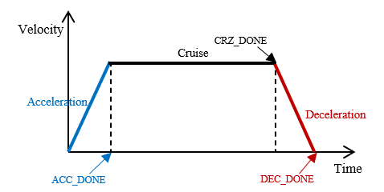

# 3. Reference


## Configuration, Initialization

본 섹션에서는 IndyScript를 사용하기에 앞서 설정 및 초기화와 관련한 기능에 대해 설명합니다.


#### 스크립트 초기화

|함수|개요|
|---|---|
|`config_script()`|현재 스크립트에 대한 설정 및 초기화|
|`start_script()`|스크립트 실행 시작점 호출|
|`end_script()`|스크립트 실행 종료점 호출|

- `config_script()`는 스크립트를 시작하기에 앞서 **로봇 모델을 설정**하고 **스크립트 초기화** 해주는 함수입니다.
  - 전달 인자 ㅡ 로봇 모델명
- `start_script()` to `end_script()`
  - IndyScript 프로그래밍 시작 및 종료 영역입니다.
  - 로봇의 설정, 제어, I/O, 데이터 수신 등 다양한 스크립트 구문 입력이 가능합니다.
  - 로봇과 관련이 없는 작업 또는 초기화 구문은 `start_script()` 이전에 작성합니다.
  - 로봇이 정상적으로 종료되었을 때 실행할 구문은 `end_script()` 이후에 작성합니다.
<br />

#### 시뮬레이션

- 시뮬레이션 사용 방법 작성

<br /><br />

## Position

공간 상의 위치는 일정한 방향성을 가지고 있는 축(기준축)과 공간 상에 고정된 점(기준점)과의 관계로 정의됩니다.
따라서 공간 상의 위치는 기준축과 기준점의 정의에 따라 다양하게 표현될 수 있지만 **로봇의 위치**를 표시할 때는 주로 각 관절의 회전축을 기준축으로 하는 **관절공간위치** 또는 직교좌표계의 각 축을 기준축으로 하는 **작업공간위치**가 주로 사용됩니다. 또한 이러한 위치들은 다시 기준점의 기준에 따라 기준점이 기준축의 원점인 경우 **절대위치**, 기준점이 현재 위치인 경우 **상대위치**로 구분됩니다.  

이 장에서는 이러한 로봇의 위치 정의에 맞게 객체를 생성하고 사용하는 방법에 대해 설명합니다.
<br />

#### 관절공간위치 (Joint Space Position)

관절공간위치는 관절위치라고도 부르며 각 관절의 회전축을 기준으로 회전한 회전각도로 로봇의 위치를 정의하는 방법입니다. 
여기서 좌측 첫번째 값은 첫번째 관절의 회전각도를 나타내며 우측으로 차례대로 관절번호가 증가하면서 해당 관절의 회전각도  (_q0_, _q1_, _q2_, _q3_, _q4_, _q5_, ...)가 담겨집니다. 이때 단위는 degree입니다(`radian`으로 변환하고 싶은 경우 [여기](#unit-setting)를 참고). 이러한 관절공간위치는 movej 명령어와 같이 관절공간에서 로봇을 이동시키는 모션명령어의 함수인자로 사용됩니다.   

- 사용방법
  - 관절공간위치클래스 `JointPos()` 사용
    - `JointPos()`는 **관절공간에서 위치를 나타내는 클래스**로서 괄호 안 좌측에서부터 우측으로 첫번째 관절부터 차례대로 회전각도를 입력합니다.
    - 상대위치를 간단하게 입력할 수 있습니다.

  ```python
  절대위치의 표현: p1 = JointPos(0, 0, 90, 0, 90, 0)          # p1 변수에 관절공간위치 클래스를 사용하여 관절공간에서의 절대위치를 입력
  상대위치의 표현: p2 = JointPos(q2=70, q4=-30)               # p2 변수에 관절공간위치 클래스를 사용하여 관절공간에서의 상대위치를 입력, JointPos(0, 0, 70, 0, -30, 0)과 동일
  ```

  - 파이썬 자료형 `리스트(list)` 사용
    - 대괄호(`[]`)를 사용하여 좌측에서부터 우측으로 첫번째 관절부터 차례대로 회전각도를 입력합니다.
    - 절대위치와 상대위치의 구분이 없어 사용시 주의해야 합니다. 

  ```python
  절대위치의 표현: p1 = [0, 0, 90, 0, 90, 0]                  # p1 변수에 파이썬의 리스트(list) 자료형을 사용해 관절공간에서의 절대위치를 입력
  상대위치의 표현: p2 = [0, 0, 70, 0, -30, 0]                 # p2 변수에 파이썬의 리스트 자료형을 사용해 관절공간에서의 상대위치를 입력
  ```    

  - 파이썬 자료형 `튜플(tuple)` 사용
    - 소괄호(`()`)를 사용하여 좌측에서부터 우측으로 첫번째 관절부터 차례대로 회전각도를 입력합니다. 
    - 절대위치와 상대위치의 구분이 없어 사용시 주의해야 합니다.

  ```python
  절대위치의 표현: p1 = (0, 0, 90, 0, 90, 0)                  # p1 변수에 파이썬의 튜플(tuple) 자료형을 사용해 관절공간에서의 절대위치를 입력
  상대위치의 표현: p2 = (0, 0, 70, 0, -30, 0)                 # p2 변수에 파이썬의 튜플 자료형을 사용해 관절공간에서의 상대위치를 입력
  ```
<br />

#### 작업공간위치 (Task Space Position)

작업공간위치는 작업위치라고도 부르며 직교좌표계(Cartesian coordinates)의 기준점에서부터 각 기준축을 따라 떨어진 거리와 각 기준축을 중심으로 회전한 각도로 로봇의 위치를 정의하는 방법입니다.
여기서 좌측 첫번째부터 세번째 값까지는 차례대로 x축, y축, z축을 따라 떨어진 거리 (_x_, _y_, _z_), 네번째부터 마지막 값까지는 차례대로 x축, y축, z축을 중심으로 회전한 회전각도 (_u_, _v_, _w_)가 담겨집니다. 이때 떨어진 거리의 단위는 meter이며, 회전각도의 단위는 degree입니다(`radian`으로 변환하고 싶은 경우 [여기](#unit-setting)를 참고). 이러한 작업공간위치는 movel 명령어와 같이 작업공간에서 로봇을 이동시키는 모션명령어의 함수인자로 사용됩니다.   

- 사용방법
  - 작업공간위치클래스 `TaskPos()` 사용
    - `TaskPos()`는 **작업공간에서 위치를 나타내는 클래스**로서 괄호 안 좌측에서부터 우측으로 차례대로 x축, y축, z축을 기준으로 떨어진 거리 및 회전한 각도를 입력합니다.
    - 상대위치를 간단하게 입력할 수 있습니다.

  ```python
  절대위치의 표현: p1 = TaskPos(0.35, -0.18, 0.52, 0, 180, 0) # p1 변수에 작업공간위치 클래스를 사용하여 작업공간에서의 절대위치를 입력
  상대위치의 표현: p2 = TaskPos(x=0.1, v=-30)                 # p2 변수에 작업공간위치 클래스를 사용하여 작업공간에서의 상대위치를 입력, TaskPos(0.1, 0, 0, 0, -30, 0)과 동일
  ```

  - 파이썬 자료형 `리스트(list)` 사용
    - 대괄호(`[]`)를 사용하여 좌측에서부터 우측으로 차례대로 x축, y축, z축을 기준으로 떨어진 거리 및 회전한 각도를 입력합니다.
    - 절대위치와 상대위치의 구분이 없어 사용시 주의해야 합니다. 

  ```python
  절대위치의 표현: p1 = [0.35, -0.18, 0.52, 0, 180, 0]        # p1 변수에 파이썬의 리스트(list) 자료형을 사용해 작업공간에서의 절대위치를 입력
  상대위치의 표현: p2 = [0.1, 0.0, 0.0, 0, -30, 0]            # p2 변수에 파이썬의 리스트 자료형을 사용해 작업공간에서의 상대위치를 입력
  ```    

  - 파이썬 자료형 `튜플(tuple)` 사용
    - 소괄호(`()`)를 사용하여 좌측에서부터 우측으로 차례대로 x축, y축, z축을 기준으로 떨어진 거리 및 회전한 각도를 입력합니다.
    - 절대위치와 상대위치의 구분이 없어 사용시 주의해야 합니다.

  ```python
  절대위치의 표현: p1 = (0.35, -0.18, 0.52, 0, 180, 0)        # p1 변수에 파이썬의 튜플(tuple) 자료형을 사용해 작업공간에서의 절대위치를 입력
  상대위치의 표현: p2 = (0.1, 0.0, 0.0, 0, -30, 0)            # p2 변수에 파이썬의 튜플 자료형을 사용해 작업공간에서의 상대위치를 입력
  ```

<br /><br />

## Motion
로봇이 특정 경로를 따라 목표위치로 이동하는 일련의 과정을 **모션**이라고 합니다. 이러한 로봇의 모션은 크게 **기본모션**, **지정모션**, **고급모션**, **응용모션**으로 구분되며 각 모션은 다시 **동기 및 비동기모션**, **절대 및 상대모션**으로 세분화해서 제공됩니다. 여기서 **동기모션**은 모션이 완료될 때까지 다음 명령어 실행을 대기하는 모션을 의미하는 반면 **비동기모션**은 모션의 시작과 동시에 다음 명령어 실행이 가능한 모션을 의미합니다. 또한 **절대모션**은 목표위치가 절대위치로 입력되는 모션을 의미하는 반면 **상대모션**은 목표위치가 상대위치로 입력되는 모션을 의미합니다. **절대위치**와 **상대위치**에 대한 정확한 개념은 [여기](#position)를 참고하세요.  
이 장에서는 이러한 로봇의 모션 종류에 대해 소개하고 사용하는 방법에 대해 설명합니다.


### 기본모션
**기본모션**은 실시간으로 경로 생성이 가능한 모션들의 집합으로 **온라인 블렌딩** 기능을 지원합니다. 여기서 **온라인 블렌딩**이란 로봇이 모션명령어가 실행되어 이미 움직이고 있는 동안에 다음 모션명령어가 실행되어 새로운 목표위치로 이동해야 할 경우 로봇이 정지하지 않고 연속해서 이동하는 모션 기능을 의미합니다. 온라인 블렌딩에 대한 자세한 내용은 [여기](#온라인-블렌딩)를 참고하세요.
기본모션은 목표위치가 정의된 공간에 따라 크게 관절공간에서의 모션과 작업공간에서의 모션으로 구분되며, **alpha 버전**에서는 대표적으로 관절공간에서의 모션 `movej`와 작업공간에서의 모션 `movel`을 제공하고 있습니다.    
<br/>

#### 동기모션
**동기모션**은 모션이 완료될 때까지 다음 명령어의 실행을 대기시키는 모션입니다. **관절공간에서의 모션**과 **작업공간에서의 모션**에서 절대모션과 상대모션을 제공합니다.
<br/>

##### movej
`movej`는 **관절공간에서의 모션**으로 각 관절의 회전축을 중심으로 **절대위치**로 주어진 목표위치까지 로봇의 각 관절들을 동시에 회전시키는 **동기모션**입니다. 따라서 `movej`는 목표위치로 1개의 관절공간에서의 **절대위치**를 입력받으며 목표위치까지 도달할 때까지 다음 명령어 실행을 대기합니다. 또한 이동경로는 시작위치와 목표위치에 따라 결정되기 때문에 공간 상에서 어떤 경로로 움직일지 사전에 예측할 수는 없지만 특이점(Singularity)과 상관없이 로봇의 모든 작업영역에서 이동이 가능하다는 것이 특징입니다. 

<center></center>

**# Syntax**
```python
movej(pos[, jv, tcp, r, bt])
```

함수인자 중 목표위치인 **관절공간위치를 제외한 모든 인자는 순서와 상관없이 입력 가능하며 또한 생략도 가능**합니다. 만약 모션인자가 생략되었다면 전역으로 설정된 값 또는 기본값이 자동으로 설정됩니다. 이러한 모션속성에 대한 자세한 설명은 [여기](#motion-properties)를 참고하세요.

|인자|설명|인자 타입|입력 예|
|---|---|---|---|
|pos|관절공간위치|1) `JointPos()` 객체 <br/> 2) 관절공간 위치가 입력된 `list` 또는 `tuple`|# 3번 및 5번관절 절대위치로 90도 이동 <br/> <span style="color:#5F9EA0"> 1) JointPos(0,0,90,0,90,0) <br/> 2) [0,0,90,0,90,0] <br/> 3) (0,0,90,0,90,0) </span>|
|jv|관절속도 및 관절가속도|1) `JointMotionVel()` 객체 <br/> 2) 관절속도 및 관절가속도가 입력된 `list` 또는 `tuple`|# 관절속도 10deg/s, 관절가속도 20deg/s^2^ <br/> <span style="color:#5F9EA0"> 1) jv=JointMotionVel(10,20) <br/> 2) jv=[10,20] <br/> 3) jv=(10,20) <br/> </span>|
|tcp|툴중심위치|1) `ToolCenterPoint()` 객체 <br/> 2) TCP가 입력된 `list` 또는 `tuple`|# 로봇 플랜지 끝단에서 z로 0.1m 이동, y축으로 45도 회전한 지점에 툴 좌표계 생성 <br/> <span style="color:#5F9EA0"> 1) tcp=ToolCenterPoint(0,0,0.1,0,45,0) <br/> 2) tcp=[0,0,0.1,0,45,0] <br/> 3) tcp=(0,0,0.1,0,45,0) </span>|
|r|블렌딩 반경|radius가 입력된 *float*형 값|# 목표위치에서 0.01m 떨어진 거리에서 온라인 블렌딩 시작 <br/> <span style="color:#5F9EA0"> r=0.01 </span>|
|bt|블렌딩 모드|*Enum* `BlendingType`|# 중첩하기(DUPLICATE) 모드로 온라인 블렌딩 진행 <br/> <span style="color:#5F9EA0"> bt=BlendingType.DUPLICATE </span> <br/> # 갈아타기(OVERRIDE) 모드로 온라인 블렌딩 진행 <br/> <span style="color:#5F9EA0"> bt=BlendingType.OVERRIDE </span>|
<br/>

**# Examples**
```python
[예제1]

  p1 = JointPos(0, 0, -90, 0, -90, 0)         # 관절위치 p1 (관절공간위치 클래스 사용)
  p2 = [90, -15, -90, 0, -75, 0]              # 관절위치 p2 (리스트 자료형 사용)
  p3 = (0, 0, 0, 0, 0, 0)                     # 관절위치 p3 (튜플 자료형 사용)

  vel = (10,20)                               # 관절속도 10deg/s, 관절가속도 20deg/s²

  movej(p1)                                   # 기본속도(30deg/s) 및 기본가속도(30deg/s²)로 p1까지 이동하며 p1에 도달할 때까지 다음 명령어 실행을 대기
  movej(p2, jv=(20,20))                       # 함수인자로 입력된 속도(20deg/s) 및 가속도(20deg/s²)로 p2까지 이동하며 p2에 도달할 때까지 다음 명령어 실행을 대기 
  movej(p3, jv=vel)                           # vel 변수에 저장된 속도(10deg/s) 및 가속도(20deg/s²)로 p3까지 이동하며 p3에 도달할 때까지 다음 명령어 실행을 대기 
  
  mwait_done()


[예제2]

  p1 = JointPos(0, 0, 0, 0, 0, 0) 
  p2 = JointPos(0, 0, -90, 0, -90, 0)   
  p3 = JointPos(90, 0, -90, 0, -90, 0)
       

  movej(p1)                                   # p1까지 이동하며 p1에 도달할 때까지 다음 명령어 실행을 대기
  movej(p2, r=0.1)                            # p2까지 이동하며 TCP와 p2간의 거리가 반경 0.1m 이내가 될 때 다음 명령어를 실행
  movej(p3)                                   # 앞선 모션이 종료되지 않은 경우 온라인 블렌딩되면서 p3까지 이동
                                              # 이때, 블렌딩 모드는 이전 모션명령어에서 결정되며 별도로 입력되지 않은 경우 기본값인 중첩하기(DUPLICATE) 모드가 반영 
  
  movej(p1)
  movej(p2, r=0.1, bt=BlendingType.OVERRIDE)  # p2까지 이동하며 TCP와 p2간의 거리가 반경 0.1m 이내가 될 때 다음 명령어를 실행
  movej(p3)                                   # 앞선 모션이 종료되지 않은 경우 온라인 블렌딩되면서 p3까지 이동 
                                              # 이때, 블렌딩 모드는 이전 모션명령어에서 입력된 갈아타기(OVERRIDE) 모드가 반영 
  mwait_done()
```

**# Related Keywords**
[rmovej](#rmovej), [amovej](#amovej), [armovej](#armovej)

<br />

##### rmovej
`rmovej`는 절대위치로 로봇을 이동시키는 `movej`와 달리 상대위치로 로봇을 이동시키는 **관절공간에서의 모션**으로 각 관절의 회전축을 중심으로 상대위치로 주어진 목표위치까지 로봇의 각 관절들을 동시에 회전시키는 **동기모션**입니다. 따라서 `rmovej`는 목표위치가 상대위치로 주어지는 점을 제외하고는 movej와 동일한 특징을 가지고 있습니다.

<center></center>

**# Syntax**
```python
rmovej(pos[, jv, tcp, r, bt])
```
함수인자 중 목표위치인 **관절공간위치를 제외한 모든 인자는 순서와 상관없이 입력 가능하며 또한 생략도 가능**합니다. 만약 모션인자가 생략되었다면 전역으로 설정된 값 또는 기본값이 자동으로 설정됩니다. 이러한 모션속성에 대한 자세한 설명은 [여기](#motion-properties)를 참고하세요.

|인자|설명|인자타입|입력 예|
|---|---|---|---|
|pos|관절공간에서의 상대위치|1) `JointPos()` 객체 <br/> 2) *named parameter*를 이용한 `JointPos()` 객체 <br/> 3) 관절공간 상대위치가 입력된 `list` 또는 `tuple`|# 1번, 2번 및 5번관절 상대위치로 이동 <br/> <span style="color:#5F9EA0"> 1) JointPos(10,-15,0,0,40,0) <br/> 2) JointPos(q1=10,q2=-15,q5=40) <br/> 3) [10,-15,0,0,40,0] <br/> 4) (10,-15,0,0,40,0) <br/>  </span>|
|jv|관절속도 및 관절가속도|1) `JointMotionVel()` 객체 <br/> 2) 관절속도 및 관절가속도가 입력된 `list` 또는 `tuple`|# 관절속도 10deg/s, 관절가속도 20deg/s^2^ <br/> <span style="color:#5F9EA0"> 1) jv=JointMotionVel(10,20) <br/> 2) jv=[10,20] <br/> 3) jv=(10,20) <br/> </span>|
|tcp|툴중심위치|1) `ToolCenterPoint()` 객체 <br/> 2) TCP가 입력된 `list` 또는 `tuple`|# 로봇 플랜지 끝단에서 z로 0.1m 이동, y축으로 45도 회전한 지점에 툴 좌표계 생성 <br/> <span style="color:#5F9EA0"> 1) tcp=ToolCenterPoint(0,0,0.1,0,45,0) <br/> 2) tcp=[0,0,0.1,0,45,0] <br/> 3) tcp=(0,0,0.1,0,45,0) </span>|
|r|블렌딩 반경|블렌딩 반경이 입력된 *float*형 값|# 목표위치에서 0.01m 떨어진 거리에서 온라인 블렌딩 시작 <br/> <span style="color:#5F9EA0"> r=0.01 </span>|
|bt|블렌딩 모드|*Enum* `BlendingType`|# 중첩하기(DUPLICATE) 모드로 온라인 블렌딩 진행 <br/> <span style="color:#5F9EA0"> bt=BlendingType.DUPLICATE </span> <br/> # 갈아타기(OVERRIDE) 모드로 온라인 블렌딩 진행 <br/> <span style="color:#5F9EA0"> bt=BlendingType.OVERRIDE </span>|
<br/>

**# Examples**
```python
[예제1]

  p1 = JointPos(0, 0, -90, 0, -90, 0)         # 관절위치 p1 (관절공간위치 클래스 사용)
  p2 = [10, 10, 10, 10, 10, 10]               # 관절위치 p2 (리스트 자료형 사용)
  p3 = (-10, -10, -10, -10, -10, -10)         # 관절위치 p3 (튜플 자료형 사용)
  p4 = JointPos(q4=30)                        # 관절위치 p4 (관절공간위치 클래스를 이용한 상대위치 표현)

  vel = (10,20)                               # 관절속도 10deg/s, 관절가속도 20deg/s²

  movej(p1)                                   # 기본속도(30deg/s) 및 기본가속도(30deg/s²)로 p1까지 이동하며 p1에 도달할 때까지 다음 명령어 실행을 대기
  rmovej(p2, jv=(20,20))                      # 함수인자로 입력된 속도(20deg/s) 및 가속도(20deg/s²)로 각 관절이 10도씩 회전하며 로봇이 정지할 때까지 다음 명령어 실행을 대기
  rmovej(p3, jv=vel)                          # vel 변수에 저장된 속도(10deg/s) 및 가속도(20deg/s²)로 각 관절이 -10도씩 회전하며 로봇이 정지할 때까지 다음 명령어 실행을 대기
  rmovej(p4, jv=vel)                          # vel 변수에 저장된 속도(10deg/s) 및 가속도(20deg/s²)로 4축만 현재 위치를 기준으로 30도 회전

  mwait_done()


[예제2]

  p1 = JointPos(0, 0, -90, 0, -90, 0) 
  p2 = JointPos(q1=-90)   
  p3 = JointPos(q4=30)
       

  movej(p1)                                   # p1까지 이동하며 p1에 도달할 때까지 다음 명령어 실행을 대기
  rmovej(p2, r=0.1)                           # 1번째 관절만 -90도 회전하며 TCP와 목표위치 간의 거리가 반경 0.1m 이내가 될 때 다음 명령어를 실행
  rmovej(p3)                                  # 앞선 모션이 종료되지 않은 경우 온라인 블렌딩되면서 4번째 관절이 30도 회전
                                              # 이때, 블렌딩 모드는 이전 모션명령어에서 결정되며 별도로 입력되지 않은 경우 기본값인 중첩하기(DUPLICATE) 모드가 반영 
  
  movej(p1)
  rmovej(p2, r=0.1, bt=BlendingType.OVERRIDE) # 1번째 관절만 -90도 회전하며 TCP와 목표위치 간의 거리가 반경 0.1m 이내가 될 때 다음 명령어를 실행
  rmovej(p3)                                  # 앞선 모션이 종료되지 않은 경우 온라인 블렌딩되면서 4번째 관절이 30도 회전 
                                              # 이때, 블렌딩 모드는 이전 모션명령어에서 입력된 갈아타기(OVERRIDE) 모드가 반영 
  mwait_done()
```

**# Related Keywords**
[movej](#movej), [amovej](#amovej), [armovej](#armovej)

<br/>

##### movel
`movel`은 **작업공간에서의 모션**으로 직교좌표계의 기준점에서부터 각 기준축을 따라 떨어진 거리와 각 기준축을 중심으로 회전한 각도를 **절대위치**로 주어진 목표위치까지 최단거리로 이동시키는 **동기모션**입니다. 따라서 `movel`은 목표위치로 1개의 작업공간에서의 **절대위치**를 입력받으며 목표위치까지 도달할 때까지 다음 명령어 실행을 대기합니다. 또한 이동경로는 시작위치에서 목표위치까지 최단거리로 가기 때문에 `movej`와 달리 어떤 경로로 움직일지 사전에 예측가능하지만 특이점(Singularity)을 고려하지 않으므로 모든 작업영역에서의 이동이 제한됩니다.
<center></center>

**# Syntax**
```python
movel(pos[, tv, tcp, r, bt])
```
함수인자 중 목표위치인 **작업공간위치를 제외한 모든 인자는 순서와 상관없이 입력 가능하며 또한 생략도 가능**합니다. 만약 모션인자가 생략되었다면 전역으로 설정된 값 또는 기본값이 자동으로 설정됩니다. 이러한 모션속성에 대한 자세한 설명은 [여기](#motion-properties)를 참고하세요.

|인자|설명|인자 타입|입력 예|
|---|---|---|---|
|pos|작업공간위치|1) `TaskPos()` 객체 <br/> 2) 작업공간위치가 입력된 `list` 또는 `tuple`|# z축으로 0.3m y축을 중심으로 90도만큼 절대위치로 이동 <br/> <span style="color:#5F9EA0"> 1) TaskPos(0,0,0.3,0,90,0) <br/> 2) [0,0,0.3,0,90,0] <br/> 3) (0,0,0.3,0,90,0) </span>|
|tv|각 축의 위치속도 및 위치가속도와 회전속도 및 회전가속도|1) `TaskMotionVel()` 객체 <br/> 2) 위치속도 및 위치가속도, 회전속도 및 회전가속도가 입력된 `list` 또는 `tuple`|# 위치속도 0.5m/s, 위치가속도 1.0m/s², 회전속도 10deg/s, 회전가속도 20deg/s² <br/> <span style="color:#5F9EA0"> 1) tv=TaskMotionVel(0.5,1,10,20) <br/> 2) tv=[0.5,1,10,20] <br/> 3) tv=(0.5,1,10,20) <br/> </span>|
|tcp|툴중심위치|1) `ToolCenterPoint()` 객체 <br/> 2) TCP가 입력된 `list` 또는 `tuple`|# 로봇 플랜지 끝단에서 z로 0.1m 이동, y축으로 45도 회전한 지점에 툴 좌표계 생성 <br/> <span style="color:#5F9EA0"> 1) tcp=ToolCenterPoint(0,0,0.1,0,45,0) <br/> 2) tcp=[0,0,0.1,0,45,0] <br/> 3) tcp=(0,0,0.1,0,45,0) </span>|
|r|블렌딩 반경|radius가 입력된 *float*형 값|# 목표위치에서 0.01m 떨어진 거리에서 온라인 블렌딩 시작 <br/> <span style="color:#5F9EA0"> r=0.01 </span>|
|bt|블렌딩 모드|*Enum* `BlendingType`|# 중첩하기(DUPLICATE) 모드로 온라인 블렌딩 진행 <br/> <span style="color:#5F9EA0"> bt=BlendingType.DUPLICATE </span> <br/> # 갈아타기(OVERRIDE) 모드로 온라인 블렌딩 진행 <br/> <span style="color:#5F9EA0"> bt=BlendingType.OVERRIDE </span>|
<br/>

**# Example**
```python
[예제1]

  p1 = TaskPos(0.35, 0.18, 0.5, 0, 180, 0)         # 작업위치 p1 (작업공간위치 클래스 사용)
  p2 = [0.35, 0.3, 0.4, 0, 180, 0]                 # 작업위치 p2 (리스트 자료형 사용)
  p3 = (0.45, 0.1, 0.5, 0, 135, 0)                 # 작업위치 p3 (튜플 자료형 사용)

  vel = TaskMotionVel(0.2, 0.4, 30, 60)            # 위치속도 0.2m/s, 위치가속도 0.4m/s², 회전속도 30deg/s, 회전가속도 60deg/s² (작업공간속도 클래스 사용)

  home()                                           # 홈위치로 이동

  movel(p1)                                        # 기본속도(0.25m/s, 0.25m/s², 30deg/s, 30deg/s²)로 p1까지 이동하며 p1에 도달할 때까지 다음 명령어 실행을 대기
  movel(p2, tv=vel)                                # vel 변수에 저장된 속도(0.2m/s, 0.4m/s², 30deg/s, 60deg/s²)로 p2까지 이동하며 p2에 도달할 때까지 다음 명령어 실행을 대기
  movel(p3, tv=(0.4, 0.8, 40, 80))                 # 함수인자로 입력된 속도(0.4m/s, 0.8m/s², 40deg/s, 80deg/s²)로 p3까지 이동하며 p3에 도달할 때까지 다음 명령어 실행을 대기

  mwait_done()

[예제2]

  p1 = TaskPos(0.35, 0.18, 0.5, 0, 180, 0)         # 작업위치 p1 (작업공간위치 클래스 사용)
  p2 = [0.35, 0.3, 0.4, 0, 180, 0]                 # 작업위치 p2 (리스트 자료형 사용)
  p3 = (0.45, 0.1, 0.5, 0, 135, 0)                 # 작업위치 p3 (튜플 자료형 사용)

  home()                                           # 홈위치로 이동

  movel(p1)                                        # p1까지 이동하며 p1에 도달할 때까지 다음 명령어 실행을 대기
  movel(p2, r=0.1)                                 # p2까지 이동하며 TCP와 p2간의 거리가 반경 0.1m 이내가 될 때 다음 명령어를 실행
  movel(p3)                                        # 앞선 모션이 종료되지 않은 경우 온라인 블렌딩되면서 p3까지 이동
                                                   # 이때, 블렌딩 모드는 이전 모션명령어에서 결정되며 별도로 입력되지 않은 경우 기본값인 중첩하기(DUPLICATE) 모드가 반영 

  movel(p1)
  movel(p2, r=0.1, bt=BlendingType.OVERRIDE)       # p2까지 이동하며 TCP와 p2간의 거리가 반경 0.1m 이내가 될 때 다음 명령어를 실행
  movel(p3)                                        # 앞선 모션이 종료되지 않은 경우 온라인 블렌딩되면서 p3까지 이동
                                                   # 이때, 블렌딩 모드는 이전 모션명령어에서 입력된 갈아타기(OVERRIDE) 모드가 반영   
```

**# Related Keywords**
[rmovel](#rmovel), [amovel](#amovel), [armovel](#armovel)
<br/>


##### rmovel
`rmovel`은 절대위치로 로봇을 이동시키는 `movel`과 달리 상대위치로 로봇을 이동시키는 **작업공간에서의 모션**으로 직교좌표계의 기준점에서부터 각 기준축을 따라 떨어진 거리와 각 기준축을 중심으로 회전한 각도를 중심으로 **상대위치**로 주어진 목표위치까지 최단거리로 이동시키는 **동기모션**입니다. 따라서 `rmovel`은 목표위치가 상대위치로 주어지는 점을 제외하고는 `movel`과 동일한 특징을 가지고 있습니다.

<center></center>

**# Syntax**
```python
rmovel(pos[, tv, tcp, r, bt])
```
함수인자 중 목표위치인 **작업공간위치를 제외한 모든 인자는 순서와 상관없이 입력 가능하며 또한 생략도 가능**합니다. 만약 모션인자가 생략되었다면 전역으로 설정된 값 또는 기본값이 자동으로 설정됩니다. 이러한 모션속성에 대한 자세한 설명은 [여기](#motion-properties)를 참고하세요.

|인자|설명|인자 타입|입력 예|
|---|---|---|---|
|pos|작업공간위치|1) `TaskPos()` 객체 <br/> 2) *named parameter*를 이용한 `TaskPos()` 객체 <br/> 3) 작업공간위치가 입력된 `list` 또는 `tuple`|# x축으로 0.1m, y축으로 -0.1m만큼 상대위치로 이동 <br/> <span style="color:#5F9EA0"> 1) TaskPos(0.1,-0.1,0,0,0,0) <br/> 2) TaskPos(x=0.1, y=-0.1) <br/> 3) [(0.1,-0.1,0,0,0,0] <br/> 4) ((0.1,-0.1,0,0,0,0) </span>|
|tv|각 축의 위치속도 및 위치가속도와 회전속도 및 회전가속도|1) `TaskMotionVel()` 객체 <br/> 2) 위치속도 및 위치가속도, 회전속도 및 회전가속도가 입력된 `list` 또는 `tuple`|# 위치속도 0.5m/s, 위치가속도 1.0m/s², 회전속도 10deg/s, 회전가속도 20deg/s² <br/> <span style="color:#5F9EA0"> 1) tv=TaskMotionVel(0.5,1,10,20) <br/> 2) tv=[0.5,1,10,20] <br/> 3) tv=(0.5,1,10,20) <br/> </span>|
|tcp|툴중심위치|1) `ToolCenterPoint()` 객체 <br/> 2) TCP가 입력된 `list` 또는 `tuple`|# 로봇 플랜지 끝단에서 z로 0.1m 이동, y축으로 45도 회전한 지점에 툴 좌표계 생성 <br/> <span style="color:#5F9EA0"> 1) tcp=ToolCenterPoint(0,0,0.1,0,45,0) <br/> 2) tcp=[0,0,0.1,0,45,0] <br/> 3) tcp=(0,0,0.1,0,45,0) </span>|
|r|블렌딩 반경|radius가 입력된 *float*형 값|# 목표위치에서 0.01m 떨어진 거리에서 온라인 블렌딩 시작 <br/> <span style="color:#5F9EA0"> r=0.01 </span>|
|bt|블렌딩 모드|*Enum* `BlendingType`|# 중첩하기(DUPLICATE) 모드로 온라인 블렌딩 진행 <br/> <span style="color:#5F9EA0"> bt=BlendingType.DUPLICATE </span> <br/> # 갈아타기(OVERRIDE) 모드로 온라인 블렌딩 진행 <br/> <span style="color:#5F9EA0"> bt=BlendingType.OVERRIDE </span>|
<br/>

  movej(p1)                                   # p1까지 이동하며 p1에 도달할 때까지 다음 명령어 실행을 대기
  rmovej(p2, r=0.1)                           # 1번째 관절만 -90도 회전하며 TCP와 목표위치 간의 거리가 반경 0.1m 이내가 될 때 다음 명령어를 실행
  rmovej(p3)                                  # 앞선 모션이 종료되지 않은 경우 온라인 블렌딩되면서 4번째 관절이 30도 회전
                                              # 이때, 블렌딩 모드는 이전 모션명령어에서 결정되며 별도로 입력되지 않은 경우 기본값인 중첩하기(DUPLICATE) 모드가 반영 
  
  movej(p1)
  rmovej(p2, r=0.1, bt=BlendingType.OVERRIDE) # 1번째 관절만 -90도 회전하며 TCP와 목표위치 간의 거리가 반경 0.1m 이내가 될 때 다음 명령어를 실행
  rmovej(p3)                                  # 앞선 모션이 종료되지 않은 경우 온라인 블렌딩되면서 4번째 관절이 30도 회전 
                                              # 이때, 블렌딩 모드는 이전 모션명령어에서 입력된 갈아타기(OVERRIDE) 모드가 반영 
  mwait_done()

**# Example**
```python
[예제 1]

  p1 = TaskPos(0.15, 0, 0.1, 0, 0, 0)         # 작업위치 p1 (작업공간위치 클래스 사용)
  p2 = [0, 0.1, 0, 0, 0, 0]                   # 작업위치 p2 (리스트 자료형 사용)
  p3 = (-0.2, -0.1, -0.15, 0, 0, 0)           # 작업위치 p3 (튜플 자료형 사용)
  p4 = TaskPos(x=0.15, v=10)                  # 작업위치 p4 (작업공간위치 클래스를 이용한 상대위치 표현)

  vel = TaskMotionVel(0.2, 0.4, 30, 60)       # 위치속도 0.2m/s, 위치가속도 0.4m/s², 회전속도 30deg/s, 회전가속도 60deg/s² (작업공간속도 클래스 사용)

  home()                                      # 홈위치로 이동

  rmovel(p1)                                  # 기본속도(0.25m/s, 0.25m/s², 30deg/s, 30deg/s²)로 현재위치에서 x축으로 0.15m, z축으로 0.1m 이동하며 목표위치에 도달할 때까지 다음 명령어 실행을 대기
  rmovel(p2, tv=vel)                          # vel 변수에 저장된 속도(0.2m/s, 0.4m/s², 30deg/s, 60deg/s²)로 현재위치에서 y축으로 0.1m 이동하며 목표위치에 도달할 때까지 다음 명령어 실행을 대기
  rmovel(p3, tv=(0.4, 0.8, 40, 80))           # 함수인자로 입력된 속도(0.4m/s, 0.8m/s², 40deg/s, 80deg/s²)로 현재위치에서 x축으로 -0.2m, y축으로 -0.1m, z축으로 -0.15m 이동하며 목표위치에 도달할 때까지 다음 명령어 실행을 대기
  rmovel(p4, tv=[0.3, 0.3, 30, 60])           # 함수인자로 입력된 속도(0.3m/s, 0.6m/s², 30deg/s, 60deg/s²)로 현재위치에서 x축으로 0.15m 이동하고, y축을 중심으로 10도 회전하며 목표위치에 도달할 때까지 다음 명령어 실행을 대기

  mwait_done()


[예제 2]

p1 = TaskPos(0.15, 0, 0.1, 0, 0, 0)         
  p2 = [0, 0.1, 0, 0, 0, 0]                 
  p3 = (-0.2, -0.1, -0.15, 0, 0, 0)      
  p4 = TaskPos(x=0.15, v=10)

  vel = TaskMotionVel(0.2, 0.4, 30, 60)

  home()

  rmovel(p1)                                        # p1까지 이동하며 p1에 도달할 때까지 다음 명령어 실행을 대기
  rmovel(p2, r=0.1)                                 # p2까지 이동하며 TCP와 p2간의 거리가 반경 0.1m 이내가 될 때 다음 명령어를 실행
  rmovel(p3)                                        # 앞선 모션이 종료되지 않은 경우 온라인 블렌딩되면서 p3까지 이동
                                                   # 이때, 블렌딩 모드는 이전 모션명령어에서 결정되며 별도로 입력되지 않은 경우 기본값인 중첩하기(DUPLICATE) 모드가 반영 

  rmovel(p1)
  rmovel(p2, r=0.1, bt=BlendingType.OVERRIDE)       # p2까지 이동하며 TCP와 p2간의 거리가 반경 0.1m 이내가 될 때 다음 명령어를 실행
  rmovel(p3)                                        # 앞선 모션이 종료되지 않은 경우 온라인 블렌딩되면서 p3까지 이동
                                                   # 이때, 블렌딩 모드는 이전 모션명령어에서 입력된 갈아타기(OVERRIDE) 모드가 반영   
```

**# Related Keywords**
[movel](#movel), [amovel](#amovel), [armovel](#armovel)
<br />

#### 비동기모션
**비동기모션**은 모션의 시작과 동시에 다음 명령어 실행이 가능한 모션입니다.
<br/>

##### amovej
`amovej`는 목표위치로 도달할 때까지 다음 명령어 실행을 대기시키는 동기모션인 `movej`와 달리 목표위치 도달여부와 관계없이 바로 다음 명령어를 실행시키는 **비동기모션**입니다. 비동기모션은 주로 모션 대기 함수([mwait](#모션-대기)) 또는 모션 종료 대기 함수([mwait_done](#모션-종료-대기))과 같은 비동기모션 대기 함수와 함께 사용합니다. 비동기로 동작하는 점을 제외하고는 `movej`와 동일한 특징을 가지고 있습니다. 

<center></center>

**# Syntax**
```python
amovej(pos[, jv, tcp, r, bt])
```
함수인자 중 목표위치인 **관절공간위치를 제외한 모든 인자는 순서와 상관없이 입력 가능하며 또한 생략도 가능**합니다. 만약 모션인자가 생략되었다면 전역으로 설정된 값 또는 기본값이 자동으로 설정됩니다. 이러한 모션속성에 대한 자세한 설명은 [여기](#motion-properties)를 참고하세요.

|인자|설명|인자타입|입력 예|
|---|---|---|---|
|pos|관절공간에서의 상대위치|1) `JointPos()` 객체 <br/> 2) 관절공간 위치가 입력된 `list` 또는 `tuple`|# 1번, 2번 및 5번관절 위치로 이동 <br/> <span style="color:#5F9EA0"> 1) JointPos(10,-15,0,0,40,0) <br/> 2) JointPos(q1=10,q2=-15,q5=40) <br/> 3) [10,-15,0,0,40,0] <br/> 4) (10,-15,0,0,40,0) <br/>  </span>|
|jv|관절속도 및 관절가속도|1) `JointMotionVel()` 객체 <br/> 2) 관절속도 및 가속도가 입력된 `list` 또는 `tuple`|# 관절속도 10deg/s, 관절가속도 20deg/s^2^ <br/> <span style="color:#5F9EA0"> 1) jv=JointMotionVel(10,20) <br/> 2) jv=[10,20] <br/> 3) jv=(10,20) <br/> </span>|
|tcp|툴중심위치|1) `ToolCenterPoint()` 객체 <br/> 2) TCP가 입력된 `list` 또는 `tuple`|# 로봇 플랜지 끝단에서 z로 0.1m 이동, y축으로 45도 회전한 지점에 툴 좌표계 생성 <br/> <span style="color:#5F9EA0"> 1) tcp=ToolCenterPoint(0,0,0.1,0,45,0) <br/> 2) tcp=[0,0,0.1,0,45,0] <br/> 3) tcp=(0,0,0.1,0,45,0) </span>|
|bt|블렌딩 모드|*Enum* `BlendingType`|# 중첩하기(DUPLICATE) 모드로 온라인 블렌딩 진행 <br/> <span style="color:#5F9EA0"> bt=BlendingType.DUPLICATE </span> <br/> # 갈아타기(OVERRIDE) 모드로 온라인 블렌딩 진행 <br/> <span style="color:#5F9EA0"> bt=BlendingType.OVERRIDE </span>|
<br/>

**# Examples**
```python
[예제]

  p1 = JointPos(0, 0, -90, 0, -90, 0)         # 관절위치 p1 (관절공간위치 클래스 사용)
  p2 = [90, -15, -90, 0, -75, 0]              # 관절위치 p2 (리스트 자료형 사용)
  p3 = (0, 0, 0, 0, 0, 0)                     # 관절위치 p3 (튜플 자료형 사용)

  vel = (10,20)                               # 관절속도 10deg/s, 관절가속도 20deg/s²

  amovej(p1)                                  # 기본속도(30deg/s) 및 기본가속도(30deg/s²)로 p1까지 이동하며 바로 다음 명령어 실행
  mwait(p=0.5)                                # p1까지 이동이 완료되면 다음 명령어 실행
  amovej(p2, jv=(20,20))                      # 함수인자로 입력된 속도(20deg/s) 및 가속도(20deg/s²)로 p2까지 이동하며 바로 다음 명령어 실행
  mwait(s=TrajStateEvent.ACC_DONE)
  amovej(p3, jv=vel)                          # vel 변수에 저장된 속도(10deg/s) 및 가속도(20deg/s²)로 p3까지 이동하며 바로 다음 명령어 실행
  
  mwait_done()
```

**# Related Keywords**
[movej](#movej), [rmovej](#rmovej), [armovej](#armovej)

<br />

##### armovej
`armovej`는 목표위치로 도달할 때까지 다음 명령어 실행을 대기시키는 동기모션인 `rmovej`와 달리 목표위치 도달여부와 관계없이 바로 다음 명령어를 실행시키는 **비동기모션**입니다. 비동기모션은 주로 모션 대기 함수([mwait](#모션-대기)) 또는 모션 종료 대기 함수([mwait_done](#모션-종료-대기))과 같은 비동기모션 대기 함수와 함께 사용합니다. 비동기로 동작하는 점을 제외하고는 `rmovej`와 동일한 특징을 가지고 있습니다. 

<center></center>

**# Syntax**
```python
armovej(pos[, jv, tcp, r, bt])
```
함수인자 중 목표위치인 관절공간위치를 제외하고는 모든 인자는 순서와 상관없이 입력 가능하며 또한 생략도 가능합니다. 만약 모션인자가 생략되었다면 전역으로 설정된 값 또는 기본값이 자동으로 설정됩니다. 이러한 모션속성에 대한 자세한 설명은 [여기](#motion-properties)를 참고하세요.

|인자|설명|인자타입|입력 예|
|---|---|---|---|
|pos|관절공간에서의 상대위치|1) `JointPos()` 객체 <br/> 2) 관절공간 상대위치가 입력된 `list` 또는 `tuple`|# 1번, 2번 및 5번관절 상대위치로 이동 <br/> <span style="color:#5F9EA0"> 1) JointPos(10,-15,0,0,40,0) <br/> 2) JointPos(q1=10,q2=-15,q5=40) <br/> 3) [10,-15,0,0,40,0] <br/> 4) (10,-15,0,0,40,0) <br/>  </span>|
|jv|관절속도 및 관절가속도|1) `JointMotionVel()` 객체 <br/> 2) 관절속도 및 가속도가 입력된 `list` 또는 `tuple`|# 관절속도 10deg/s, 관절가속도 20deg/s^2^ <br/> <span style="color:#5F9EA0"> 1) jv=JointMotionVel(10,20) <br/> 2) jv=[10,20] <br/> 3) jv=(10,20) <br/> </span>|
|tcp|툴중심위치|1) `ToolCenterPoint()` 객체 <br/> 2) TCP가 입력된 `list` 또는 `tuple`|# 로봇 플랜지 끝단에서 z로 0.1m 이동, y축으로 45도 회전한 지점에 툴 좌표계 생성 <br/> <span style="color:#5F9EA0"> 1) tcp=ToolCenterPoint(0,0,0.1,0,45,0) <br/> 2) tcp=[0,0,0.1,0,45,0] <br/> 3) tcp=(0,0,0.1,0,45,0) </span>|
|bt|블렌딩 모드|*Enum* `BlendingType`|# 중첩하기(DUPLICATE) 모드로 온라인 블렌딩 진행 <br/> <span style="color:#5F9EA0"> bt=BlendingType.DUPLICATE </span> <br/> # 갈아타기(OVERRIDE) 모드로 온라인 블렌딩 진행 <br/> <span style="color:#5F9EA0"> bt=BlendingType.OVERRIDE </span>|
<br/>

**# Examples**
```python
[예제1]

  p1 = JointPos(0, 0, -90, 0, -90, 0)         # 관절위치 p1 (관절공간위치 클래스 사용)
  p2 = [10, 10, 10, 10, 10, 10]               # 관절위치 p2 (리스트 자료형 사용)
  p3 = (-10, -10, -10, -10, -10, -10)         # 관절위치 p3 (튜플 자료형 사용)
  p4 = JointPos(q4=30)                        # 관절위치 p4 (관절공간위치 클래스를 이용한 상대위치 표현)

  vel = (10,20)                               # 관절속도 10deg/s, 관절가속도 20deg/s²

  movej(p1)                                   # 기본속도(30deg/s) 및 기본가속도(30deg/s²)로 p1까지 이동하며 p1에 도달할 때까지 다음 명령어 실행을 대기
  armovej(p2, jv=(20,20))                     # 함수인자로 입력된 속도(20deg/s) 및 가속도(20deg/s²)로 각 관절이 10도씩 회전하며 바로 다음 명령어 실행
  mwait(s=TrajStateEvent.CRZ_DONE)            # 등속구간 종료될 때 다음 명령어 실행
  armovej(p3, jv=vel)                         # vel 변수에 저장된 속도(10deg/s) 및 가속도(20deg/s²)로 각 관절이 -10도씩 회전하며 바로 다음 명령어 실행을 대기
  mwait(t=3)                                  # 3초가 지날 때 다음 명령어 실행
  armovej(p4, jv=vel)                         # vel 변수에 저장된 속도(10deg/s) 및 가속도(20deg/s²)로 4축만 현재 위치를 기준으로 30도 회전하며 바로 다음 명령어
  mwait(p=0.6)                                # 현재 모션이 60% 완료될 때 다음 명령어 실행

  mwait_done()
```
<br/>

**# Related Keywords**
[movej](#movej), [rmovej](#rmovej), [amovej](#amovej)

<br/>


##### amovel
`amovel`은 목표위치로 도달할 때까지 다음 명령어 실행을 대기시키는 동기모션인 `movel`과 달리 목표위치 도달여부와 관계없이 바로 다음 명령어를 실행시키는 **비동기모션**입니다. 비동기모션은 주로 모션 대기 함수([mwait](#모션-대기)) 또는 모션 종료 대기 함수([mwait_done](#모션-종료-대기))과 같은 비동기모션 대기 함수와 함께 사용합니다. 비동기로 동작하는 점을 제외하고는 `movel`과 동일한 특징을 가지고 있습니다.

<center></center>

**# Syntax**
```python
amovel(pos[, tv, tcp, r, bt])
```
함수인자 중 목표위치인 **작업공간위치를 제외한 모든 인자는 순서와 상관없이 입력 가능하며 또한 생략도 가능**합니다. 만약 모션인자가 생략되었다면 전역으로 설정된 값 또는 기본값이 자동으로 설정됩니다. 이러한 모션속성에 대한 자세한 설명은 [여기](#motion-properties)를 참고하세요.

|인자|설명|인자 타입|입력 예|
|---|---|---|---|
|pos|작업공간위치|1) `TaskPos()` 객체 <br/> 2) 작업공간위치가 입력된 `list` 또는 `tuple`|# z축으로 0.3m y축을 중심으로 90도만큼 절대위치로 이동 <br/> <span style="color:#5F9EA0"> 1) TaskPos(0,0,0.3,0,90,0) <br/> 2) [0,0,0.3,0,90,0] <br/> 3) (0,0,0.3,0,90,0) </span>|
|tv|각 축의 위치속도 및 위치가속도와 회전속도 및 회전가속도|1) `TaskMotionVel()` 객체 <br/> 2) 위치속도 및 위치가속도, 회전속도 및 회전가속도가 입력된 `list` 또는 `tuple`|# 위치속도 0.5m/s, 위치가속도 1.0m/s², 회전속도 10deg/s, 회전가속도 20deg/s² <br/> <span style="color:#5F9EA0"> 1) tv=TaskMotionVel(0.5,1,10,20) <br/> 2) tv=[0.5,1,10,20] <br/> 3) tv=(0.5,1,10,20) <br/> </span>|
|tcp|툴중심위치|1) `ToolCenterPoint()` 객체 <br/> 2) TCP가 입력된 `list` 또는 `tuple`|# 로봇 플랜지 끝단에서 z로 0.1m 이동, y축으로 45도 회전한 지점에 툴 좌표계 생성 <br/> <span style="color:#5F9EA0"> 1) tcp=ToolCenterPoint(0,0,0.1,0,45,0) <br/> 2) tcp=[0,0,0.1,0,45,0] <br/> 3) tcp=(0,0,0.1,0,45,0) </span>|
|bt|블렌딩 모드|*Enum* `BlendingType`|# 중첩하기(DUPLICATE) 모드로 온라인 블렌딩 진행 <br/> <span style="color:#5F9EA0"> bt=BlendingType.DUPLICATE </span> <br/> # 갈아타기(OVERRIDE) 모드로 온라인 블렌딩 진행 <br/> <span style="color:#5F9EA0"> bt=BlendingType.OVERRIDE </span>|
<br/>

**# Examples**
```python
[예제1]

  p1 = TaskPos(0.35, 0.18, 0.5, 0, 180, 0)         # 작업위치 p1 (작업공간위치 클래스 사용)
  p2 = [0.35, 0.3, 0.4, 0, 180, 0]                 # 작업위치 p2 (리스트 자료형 사용)
  p3 = (0.45, 0.1, 0.5, 0, 135, 0)                 # 작업위치 p3 (튜플 자료형 사용)

  vel = TaskMotionVel(0.2, 0.4, 30, 60)            # 위치속도 0.2m/s, 위치가속도 0.4m/s², 회전속도 30deg/s, 회전가속도 60deg/s² (작업공간속도 클래스 사용)

  home()                                           # 홈위치로 이동

  amovel(p1)                                       # 기본속도(0.25m/s, 0.25m/s², 30deg/s, 30deg/s²)로 p1까지 이동하며 바로 다음 명령어 실행
  mwait(t=1)                                       # 1초 후에 다음 명령어 실행
  amovel(p2, tv=vel)                               # vel 변수에 저장된 속도(0.2m/s, 0.4m/s², 30deg/s, 60deg/s²)로 p2까지 이동하며 바로 다음 명령어 실행
  amovel(p3, tv=(0.4, 0.8, 40, 80))                # 함수인자로 입력된 속도(0.4m/s, 0.8m/s², 40deg/s, 80deg/s²)로 p3까지 이동하며 바로 다음 명령어 실행

  mwait_done()
```
<br/>


**# Related Keywords**
[movel](#movel), [rmovel](#rmovel), [armovel](#armovel)

<br/>

##### armovel
`armovel`은 목표위치로 도달할 때까지 다음 명령어 실행을 대기시키는 동기모션인 `rmovel`과 달리 목표위치 도달여부와 관계없이 바로 다음 명령어를 실행시키는 **비동기모션**입니다. 비동기모션은 주로 모션 대기 함수([mwait](#모션-대기)) 또는 모션 종료 대기 함수([mwait_done](#모션-종료-대기))과 같은 비동기모션 대기 함수와 함께 사용합니다. 비동기로 동작하는 점을 제외하고는 `rmovel`과 동일한 특징을 가지고 있습니다.

<center></center>

**# Syntax**
```python
armovel(pos[, tv, tcp, r, bt])
```
함수인자 중 목표위치인 **작업공간위치를 제외한 모든 인자는 순서와 상관없이 입력 가능하며 또한 생략도 가능**합니다. 만약 모션인자가 생략되었다면 전역으로 설정된 값 또는 기본값이 자동으로 설정됩니다. 이러한 모션속성에 대한 자세한 설명은 [여기](#motion-properties)를 참고하세요.

|인자|설명|인자 타입|입력 예|
|---|---|---|---|
|pos|작업공간위치|1) `TaskPos()` 객체 <br/> 2) *named parameter*를 이용한 `TaskPos()` 객체 <br/> 3) 작업공간위치가 입력된 `list` 또는 `tuple`|# x축으로 0.1m, y축으로 -0.1m만큼 상대위치로 이동 <br/> <span style="color:#5F9EA0"> 1) TaskPos(0.1,-0.1,0,0,0,0) <br/> 2) TaskPos(x=0.1, y=-0.1) <br/> 3) [(0.1,-0.1,0,0,0,0] <br/> 4) ((0.1,-0.1,0,0,0,0) </span>|
|tv|각 축의 위치속도 및 위치가속도와 회전속도 및 회전가속도|1) `TaskMotionVel()` 객체 <br/> 2) 위치속도 및 위치가속도, 회전속도 및 회전가속도가 입력된 `list` 또는 `tuple`|# 위치속도 0.5m/s, 위치가속도 1.0m/s², 회전속도 10deg/s, 회전가속도 20deg/s² <br/> <span style="color:#5F9EA0"> 1) tv=TaskMotionVel(0.5,1,10,20) <br/> 2) tv=[0.5,1,10,20] <br/> 3) tv=(0.5,1,10,20) <br/> </span>|
|tcp|툴중심위치|1) `ToolCenterPoint()` 객체 <br/> 2) TCP가 입력된 `list` 또는 `tuple`|# 로봇 플랜지 끝단에서 z로 0.1m 이동, y축으로 45도 회전한 지점에 툴 좌표계 생성 <br/> <span style="color:#5F9EA0"> 1) tcp=ToolCenterPoint(0,0,0.1,0,45,0) <br/> 2) tcp=[0,0,0.1,0,45,0] <br/> 3) tcp=(0,0,0.1,0,45,0) </span>|
|bt|블렌딩 모드|*Enum* `BlendingType`|# 중첩하기(DUPLICATE) 모드로 온라인 블렌딩 진행 <br/> <span style="color:#5F9EA0"> bt=BlendingType.DUPLICATE </span> <br/> # 갈아타기(OVERRIDE) 모드로 온라인 블렌딩 진행 <br/> <span style="color:#5F9EA0"> bt=BlendingType.OVERRIDE </span>|
<br/>

**# Examples**
```python
[예제 1]
```
<br/>


**# Related Keywords**
[movel](#movel), [rmovel](#rmovel), [amovel](#amovel)

<br /><br />

### 지정모션
**지정모션**은 목표위치가 미리 정해져 있는 모션입니다. 현재 위치를 초기화할 때 주로 사용하며, 홈위치로 이동시키는 모션인 `home`과 원위치로 이동시키는 모션인 `zero`를 제공합니다.

#### home
`home`은 **관절공간에서의 모션**으로 각 관절의 회전축을 중심으로 **홈위치**로 로봇의 각 관절들을 동시에 회전시키는 **동기모션**입니다. 따라서 목표위치가 홈위치로 정해져 있는 점을 제외하면 `movej`와 동일한 특징을 가지고 있습니다.
<br />

**# Syntax**
```python
home([jv, r, bt])
```
|인자|설명|인자 타입|입력 예|
|---|---|---|---|
|jv|관절속도 및 관절가속도|1) `JointMotionVel()` 객체 <br/> 2) 관절속도 및 가속도가 입력된 `list` 또는 `tuple`|# 관절속도 10deg/s, 관절가속도 20deg/s^2^ <br/> <span style="color:#5F9EA0"> 1) jv=JointMotionVel(10,20) <br/> 2) jv=[10,20] <br/> 3) jv=(10,20) <br/> </span>|
|r|블렌딩 반경|radius가 입력된 *float*형 값|# 목표위치에서 0.01m 떨어진 거리에서 온라인 블렌딩 시작 <br/> <span style="color:#5F9EA0"> r=0.01 </span>|
|bt|블렌딩 모드|*Enum* `BlendingType`|# 중첩하기(DUPLICATE) 모드로 온라인 블렌딩 진행 <br/> <span style="color:#5F9EA0"> bt=BlendingType.DUPLICATE </span> <br/> # 갈아타기(OVERRIDE) 모드로 온라인 블렌딩 진행 <br/> <span style="color:#5F9EA0"> bt=BlendingType.OVERRIDE </span>|
<br/>

#### ahome
`ahome`은 홈위치로 도달할 때까지 다음 명령어 실행을 대기시키는 동기모션인 `home`과 달리 홈위치 도달여부와 관계없이 바로 다음 명령어를 실행시키는 **비동기모션**입니다. 비동기모션은 주로 모션 대기 함수([mwait](#모션-대기)) 또는 모션 종료 대기 함수([mwait_done](#모션-종료-대기))과 같은 비동기모션 대기 함수와 함께 사용합니다. 비동기로 동작하는 점을 제외하고는 `home`과 동일한 특징을 가지고 있습니다.

**# Syntax**
```python
ahome()
```
|인자|설명|인자 타입|입력 예|
|---|---|---|---|
|jv|관절속도 및 관절가속도|1) `JointMotionVel()` 객체 <br/> 2) 관절속도 및 가속도가 입력된 `list` 또는 `tuple`|# 관절속도 10deg/s, 관절가속도 20deg/s^2^ <br/> <span style="color:#5F9EA0"> 1) jv=JointMotionVel(10,20) <br/> 2) jv=[10,20] <br/> 3) jv=(10,20) <br/> </span>|
|bt|블렌딩 모드|*Enum* `BlendingType`|# 중첩하기(DUPLICATE) 모드로 온라인 블렌딩 진행 <br/> <span style="color:#5F9EA0"> bt=BlendingType.DUPLICATE </span> <br/> # 갈아타기(OVERRIDE) 모드로 온라인 블렌딩 진행 <br/> <span style="color:#5F9EA0"> bt=BlendingType.OVERRIDE </span>|

#### zero

<br/><br/>

### 고급 모션

#### 추후 개발 예정
<br />

### 응용 모션

#### 추후 개발 예정
<br />

### 대기(Wait)
**대기**는 모션이 실행되기 전 또는 모션이 실행된 후에 사용하며, 각 이벤트의 조건을 만족하는 경우에 다음 명령어를 실행할 수 있도록 제어합니다. 함수 인자로 사용되는 이벤트는 크게 2가지로 나뉘며, 비동기 또는 동기모션과 상호작용하는 [모션 대기 이벤트](#모션-대기-이벤트)와 I/O (**alpha 버전**에서는 Input 대기만 제공)와 상호작용하는 [I/O 대기 이벤트](#io-대기-이벤트)를 제공합니다. 
<br/>

#### mwait
`mwait`는 비동기모션의 현재 모션 속도구간과 수행정도, 수행시간에 따라 다음 명령어 실행을 대기시키는 `status`이벤트와 `progress`이벤트, `time`이벤트와 함께 비동기모션을 제어하며, 동기모션이 완료되고 다음 명령어를 `n`초간 대기시키는 `time`이벤트와 함께 동기모션을 제어합니다.(`time`이벤트에 대한 자세한 설명은 [여기](#모션-대기-이벤트)를 참고해주세요) 또한, I/O 조건을 만족할 때까지 다음 명령어 실행을 대기시키는 I/O 대기 이벤트(`di`, `ai`, `ei`, 자세한 설명은 [여기](#io-대기-이벤트)를 참고해주세요)와 함께 사용합니다.
<br/>

**# Syntax**
```python
mwait([state(s), progress(p), time(t), di, ai, ei])
```
함수인자로 6가지 이벤트 중 반드시 한가지 이벤트를 인자로 전달해야합니다. 


|이벤트|설명|이벤트타입|입력 예|
|---|---|---|---|
|status(s)|현재 모션의 속도구간|*Enum* `TrajStateEvent`|# 가속구간 종료 지점에서 다음 명령어 실행<br/> <span style="color:#5F9EA0"> mwait(status=TrajStateEvent.ACC_DONE) <br/> </span># 등속구간 종료 지점에서 다음 명령어 실행<br/> <span style="color:#5F9EA0"> mwait(status=TrajStateEvent.CRZ_DONE) <br/> </span># 감속구간 종료 지점에서 다음 명령어 실행<br/> <span style="color:#5F9EA0"> mwait(s=TrajStateEvent.DEC_DONE) <br/> </span># MotionStop, Violation등의 Motion Interrupt가 발생하여 모션이 취소될 때 다음 명령어 실행<br/> <span style="color:#5F9EA0"> mwait(s=TrajStateEvent.CANCLE) <br/> </span>|
|progress(p)|현재 모션의 수행정도|0.0 ~ 1.0 사이의 *float*형 값|# 모션이 70% 완료될 때 다음 명령어 실행 <br/> <span style="color:#5F9EA0"> mwait(progress=0.7) <br/></span> # 모션이 30% 완료될 때 다음 명령어 실행<br/> <span style="color:#5F9EA0"> mwait(p=0.3) <br/> </span>|
|time(t)|# 비동기모션<br/>모션이 실행된 시점부터의 대기시간<br/># 동기모션<br/>모션이 완료된 시점부터의 대기시간|초 단위 *int*형 값|# 모션 실행 시점부터 3초 후에 다음 명령어 실행 <br/> <span style="color:#5F9EA0"> mwait(time=3) <br/></span> # 모션 실행 시점부터 2초 후에 다음 명령어 실행 <br/><span style="color:#5F9EA0"> mwait(t=2) </span>|
|di|Digital Input 신호|1) [DIO](#io-나타내기) <br/> 2) [DIOSet](#io-나타내기) <br/> 3) 인덱스와 신호값이 입력된 `list` 또는 `tuple`|# 0번째 Digital Input값이 HIGH가 될 때 다음 명령어 실행 <br/> <span style="color:#5F9EA0"> mwait(di=DIO(0,HIGH)) <br/></span> # 0번째 Digital Input값이 LOW, 1번째 Digital Input값이 HIGH가 될 때 다음 명령어 실행 <br/> <span style="color:#5F9EA0"> mwait(di=DIOSet((0,LOW), (1,HIGH)) <br/></span> # 2번째 Digital Input값이 LOW가 될 때 다음 명령어 실행 <br/> <span style="color:#5F9EA0"> mwait(di=(2,LOW)) </span>|
|ai|Analog Input 신호|1) [AIO](#io-나타내기) <br/> 2) [AIOSet](#io-나타내기) <br/> 3) 인덱스와 신호값이 입력된 `list` 또는 `tuple`|# 0번째 Analog Input값이 31이 될 때 다음 명령어 실행 <br/> <span style="color:#5F9EA0"> mwait(ai=AIO(0,31)) <br/></span> # 0번째 Analog Input값이 25, 1번째 Analog Input값이 35가 될 때 다음 명령어 실행 <br/> <span style="color:#5F9EA0"> mwait(ai=AIOSet((0,25), (1,35)) <br/></span> # 2번째 Analog Input값이 0이 될 때 다음 명령어 실행 <br/> <span style="color:#5F9EA0"> mwait(ai=(2,0)) </span>|
|ei|Endtool Input 신호|1) [DIO](#io-나타내기) <br/> 2) [DIOSet](#io-나타내기) <br/> 3) 인덱스와 신호값이 입력된 `list` 또는 `tuple`|# 0번째 Endtool Input값이 HIGH가 될 때 다음 명령어 실행 <br/> <span style="color:#5F9EA0"> mwait(ei=DIO(0,HIGH)) <br/></span> # 0번째 Endtool Input값이 LOW, 1번째 Endtool Input값이 HIGH가 될 때 다음 명령어 실행 <br/> <span style="color:#5F9EA0"> mwait(ei=DIOSet((0,LOW), (1,HIGH)) <br/></span> # 2번째 Endtool Input값이 LOW가 될 때 다음 명령어 실행 <br/> <span style="color:#5F9EA0"> mwait(ei=(2,LOW)) </span>|
<br/>

**# Example**
```python
[예제1]

p1 = JointPos(0, 0, -90, 0, -90, 0)         # 관절위치 p1 (관절공간위치 클래스 사용)
p2 = [90, -15, -90, 0, -75, 0]              # 관절위치 p2 (리스트 자료형 사용)

amovej(p1)
mwait(status)=TrajStateEvent.ACC_DONE)      # 목표위치 p1으로 이동 중 가속구간 종료 지점에서 다음 명령어 실행
amovej(p2)
mwait(s=TrajStateEvent.DEC_DONE)            # 목표위치 p2로 이동 중 감속구간 종료 지점에서 다음 명령어 실행


[예제2]

p1 = JointPos(0, 0, -90, 0, -90, 0)
p2 = [90, -15, -90, 0, -75, 0]

amovej(p1)
mwait(progress=0.7)                         # 목표위치 p1으로 이동하는 모션이 70% 완료되면 다음 명령어 실행
amovej(p2)
mwait(p=0.3)                                # 목표위치 p2로 이동하는 모션이 30% 완료되면 다음 명령어 실행


[예제3-1]
- 비동기모션

  p1 = JointPos(0, 0, -90, 0, -90, 0)
  p2 = [90, -15, -90, 0, -75, 0]

  amovej(p1)
  mwait(time=3)                               # 목표위치 p1으로 이동 시점부터 3초가 경과하면 다음 명령어 실행


[예제3-2]
- 동기모션

  p1 = JointPos(0, 0, -90, 0, -90, 0)
  p2 = [90, -15, -90, 0, -75, 0]

  movej(p1)
  mwait(time=3)                               # 목표위치 p1으로 이동 완료 시점부터 3초 대기 후 다음 명령어 실행


[예제4-1]
- 비동기모션

  movej(JointPos(-0.114, -11.241, -60.707, 0.004, -108.086, -0.072))

  mwait(di=(18, HIGH))                            #DI(18)에 연결된 토글스위치를 누르면 다음 명령어 실행 
  armovel(TaskPos(y=0.1))
  mwait(di=(18, LOW))                             #DI(18)에 연결된 토글스위치를 해제하면 다음 명령어 실행
  armovel(TaskPos(z=-0.1))


[예제4-2]
- 동기모션

  movej(JointPos(-0.114, -11.241, -60.707, 0.004, -108.086, -0.072))

  mwait(di=(18, HIGH))                            #DI(18)에 연결된 토글스위치를 누르면 다음 명령어 실행 
  armovel(TaskPos(y=0.1))
  mwait(di=(18, LOW))                             #DI(18)에 연결된 토글스위치를 해제하면 다음 명령어 실행
  armovel(TaskPos(z=-0.1))
```
<br/>

##### 모션 대기 이벤트
**모션 대기 이벤트**는 모션 대기 함수의 인자로 전달되며 **비동기모션**에만 적용가능한 모션의 속도구간에 따른 이벤트 `status`와 모션의 수행정도에 따른 이벤트 `progress`, **동기, 비동기모션** 모두 적용가능한 시간대기 이벤트 `time`을 제공합니다.

- `status`
  - `TrajStateEvent` Enum 내의 다음 **4가지 경우를 만족하는 경우**에 다음 명령어를 실행합니다.
    - `ACC_DONE`: 가속구간 종료 지점
    - `CRZ_DONE`: 등속구간 종료 지점
    - `DEC_DONE`: 감속구간 종료 지점
    - `CANCLE`: MotionStop, Violation등의 Motion Interrupt가 발생하여 모션이 취소되는 경우
    - *named parameter*로 인자 전달 ━ `status` 또는 `s`
<center></center>

- `progress`
  - 현재 실행 중인 비동기모션의 **수행정도**를 만족하는 경우에 다음 명령어를 실행합니다.
  - 수행정도는 0 ~ 100 %로 구분하며, 0.0 ~ 1.0 사이의 `float` 값으로 입력합니다.
    - 0.0 ≤ `progress` ≤ 1.0
  - *named parameter*로 인자 전달 ━ `progress` 또는 `p`

- `time`
  - 비동기모션
    - 모션 실행 시점부터 주어진 시간을 만족하면 다음 명령어를 실행합니다.
  - 동기모션
    - 모션 완료 시점부터 주어진 시간을 만족하면 다음 명령어를 실행합니다.
  - *named parameter*로 인자 전달 ━ `time` 또는 `t`
<br />

##### I/O 대기 이벤트
**I/O 대기 이벤트**는 **동기모션**, **비동기모션** 모두 사용가능하며, 현재 **alpha버전에 한해서** Digital Input, Analog Input, Endtool Input에 대한 수신 이벤트만 제공합니다. **비동기모션**의 경우 모션이 실행된 후 I/O 조건이 만족되면, 그 즉시 다음 명령어를 실행하는 것을 우선 적용하고, 비동기모션이 완료될 때까지 I/O 조건이 만족되지 않을 경우는 동기모션과 동일합니다. **동기모션**의 경우 모션이 모두 완료된 후 I/O 조건이 만족될 때까지 대기합니다.

- I/O에 대한 사용방법 및 자세한 설명은 [여기](#io)를 참고해주세요.
<br /><br />

### 모션 종료 대기
현재 **alpha버전에 한해서** 동기모션 바로 다음에 모션명령어가 아닌 다른 명령어가 사용될 경우 모션이 목표위치에 도달하지 않더라도 다음 명령어가 실행됩니다. **즉, 동기모션이 비동기모션처럼 작동하는 것처럼 보일 수 있습니다.** 따라서 동기모션 다음으로 프로그램 흐름이 변경되는 구문(if, for 등)이 호출되기 전이나 다른 작업(함수호출, I/O 등)이 필요할 때 반드시 모션이 종료할 때까지 대기하는 `mwait_done`을 사용해야합니다. 

#### mwait_done
`mwait_done`은 현재 실행 중인 모션이 완료될 때까지 다음 명령어 실행을 대기시킵니다.
<br />

**# Syntax**
```python
mwait_done()
```

|상황|설명|입력 예|
|---|---|---|
|Conditional Statements|`if`, `elif`, `else` 와 같은 조건문 전에 동기모션 사용시 |# 조건문 전에 mwait_done() 사용<br/> <span style="color:#5F9EA0"> mwait_done()<br/>if ...:<br/> </span>|
|Looping Statements|`for`, `while` 과 같은 반복문 안과 밖에 동기모션 사용 시|# 반복문 시작 전과 반복문 구문 내 마지막에 mwait_done() 사용 <br/> <span style="color:#5F9EA0"> mwait_done()<br/>for i in range(...):<br/></span>|
|Etc|모션 사이에 함수 호출, I/O등 다른 작업을 해야할 경우|# 함수 호출시 작업 전에 mwait_done() 사용 <br/> <span style="color:#5F9EA0"> mwait_done()<br/>user_function()<br/></span># I/O 처리시 작업 전에 mwait_done() 사용 <br/> <span style="color:#5F9EA0"> mwait_done()<br/>do(0, HIGH)<br/></span>|

**# Example**
```python
[예제1]

movej(p1)

mwait_done()
if ...:
  movel(p2)


[예제2]

movej(p1)

mwait_done()
for i in range(...):
  rmovel(y=-0.05)
  mwait_done()


[예제3]

movej(p1)
mwait_done()
user_function()        # 함수 호출

movej(p2)
mwait_done()
do(0, HIGH)            # I/O 처리
```
<br />

#### 비동기모션과 모션 종료 대기

동기 모션과 달리 **비동기모션**은 바로 다음 명령을 실행시킬 수 있기 때문에 `mwait_done()`을 **생략**하여 모션 스크립트 작성을 할 수도 있습니다.

```python
amovel(pos1)
# mwait_done()    # mwait_done() 생략
do(0, HIGH)       # pos1으로 이동할 때 바로 DO[0]에 HIGH 신호를 준 상태에서 이동


start = (0.736, -0.276, 0.542, 159.344, 48.516, 156.01)  # 모션 시작점 설정
end = (0.736, 0.243, 0.542, 159.412, 48.581, 156.658)    # 모션 끝점 설정

home()
movel(start)
amovel(end)
mwait(s=TrajStateEvent.ACC_DONE)   # 끝점으로 이동 중 가속완료시 아래 코드 실행
do(8,HIGH)      # DO(08) LED 신호를 ON
mwait_done()
do(8,LOW)       # 끝점 도달(모션 종료)후, LED 신호 OFF
```

<br /><br />

## Motion Properties
본 섹션에서는 모션 속성이 무엇이고, 어떻게 표현하고 설정하는 지 등 모션 속성에 대한 전반적인 내용을 설명합니다. 앞서 설명해온 모션 함수는 단순히 `pos1`에서 `pos2`로 이동하는 모션이었지만, 모션 속성을 활용한다면 모션의 속도제어, 블렌딩 설정 등 다양한 방법으로 **모션을 제어**가 가능합니다. 또한, 참조 좌표 공간을 지정하여 로봇의 설치 위치를 자유롭게 선택할 수 있습니다.
<br />

### 전역속성
**전역속성**은 [모션](#motion)에서 함수인자를 통해 단일모션에 대한 속성 설정과는 달리 개별 함수를 통해 전역으로 모션속성을 설정합니다. 전역속성 설정을 하게되면 해당 설정 이후의 모든 모션 속성의 기본값으로 반영됩니다. 

#### intpr_type
`intpr_type`은 모션의 경로를 생성 유형에 대한 속성입니다.

**# Syntax**
```python
intpr_type(InterpolatorType[.CONSTVEL, TIMEOPT, TIME])
print(intpr_type())
```
함수인자는 *Enum* `InterpolatorType`을 입력해야하며, `CONSTVEL`, `TIMEOPT`, `TIME` 중 하나를 선택하여 입력해야합니다. 함수인자를 입력하지 않을 경우 현재 설정되어있는 `InterpolatorType`가 반환됩니다.

|인자|설명|인자타입|입력 예|
|---|---|---|---|
|InterpolatorType|모션 경로 생성 유형|*Enum* `InterpolatorType`|# 속도기반 모션 경로 생성(CONSTVEL) <br/> <span style="color:#5F9EA0"> 1) intpr_type(InterpolatorType.CONSTVEL) <br/></span> # 시간최적화(TIMEOPT)<br/><span style="color:#5F9EA0">2) intpr_type(InterpolatorType.TIMEOPT) <br/></span> # 시간기반 모션 경로 생성(TIME)<br/> <span style="color:#5F9EA0">3) intpr_type(InterpolatorType.TIME)</span>|

<br/>


#### joint_vel
`joint_vel`은 관절속도와 관절가속도에 대한 속성입니다.

**# Syntax**
```python
joint_vel(JointMotionVel(float vel, float acc))
joint_vel([float vel, float acc])
joint_vel((float vel, float acc))
print(joint_vel())
```
함수인자는 `JointMotionVelocity`를 입력해야하며, `JointMotionVel` 객체 또는 `list`, `tuple`로 표현이 가능합니다. 함수인자를 입력하지 않을 경우 현재 설정되어있는 `JointMotionVelocity`가 `tuple`형태로 반환됩니다.

|인자|설명|인자타입|입력 예|
|---|---|---|---|
|JointMotionVelocity|관절속도 및 관절가속도|1) `JointMotionVel` 객체 <br/> 2) 관절속도 및 관절가속도가 입력된 `list` 또는 `tuple`|# 관절속도 10deg/s, 관절가속도 20deg/s^2^ <br/> <span style="color:#5F9EA0"> 1) joint_vel(JointMotionVel(10,20)) <br/> 2) joint_vel([10,20]) <br/> 3) joint_vel((10,20)) <br/> </span>|

<br/>

#### joint_time
`joint_time`은 관절공간에서의 모션시간에 대한 속성입니다.

**# Syntax**
```python
joint_time(float time)
print(joint_time())
```
함수인자는 `JointMotionTime`을 입력해야하며, *float*형 값으로 표현이 가능합니다. 함수인자를 입력하지 않을 경우 현재 설정되어있는 `JointMotionTime`이 반환됩니다.

|인자|설명|인자타입|입력 예|
|---|---|---|---|
|JointMotionTime|관절공간에서의 모션시간|모션시간이 입력된 *float*형 값|# 현재 movej 모션을 5초에 맞춰 실행합니다. <br/> <span style="color:#5F9EA0"> joint_time(5) <br/> </span>|

<br/>

#### task_vel
`task_vel`은 각 축의 위치속도 및 위치가속도와 회전속도 및 회전가속도에 대한 속성입니다.

**# Syntax**
```python
task_vel(TaskMotionVel(dispVel, dispAcc, rotVel, rotAcc))
task_vel([dispVel, dispAcc, rotVel, rotAcc])
task_vel((dispVel, dispAcc, rotVel, rotAcc))
print(task_vel())
```
함수인자는 `TaskMotionVelocity`를 입력해야하며, `TaskMotionVel` 객체 또는 `list`, `tuple`로 표현이 가능합니다. 함수인자를 입력하지 않을 경우 현재 설정되어있는 `TaskMotionVelocity`가 `tuple`형태로 반환됩니다.

|인자|설명|인자타입|입력 예|
|---|---|---|---|
|TaskMotionVelocity|각 축의 위치속도 및 위치가속도와 회전속도 및 회전가속도|1) `TaskMotionVel` 객체 <br/> 2) 위치속도 및 위치가속도와 회전속도 및 회전가속도가 입력된 `list` 또는 `tuple`|# 관절속도 10deg/s, 관절가속도 20deg/s^2^ <br/> <span style="color:#5F9EA0"> # 위치속도 0.5m/s, 위치가속도 1.0m/s², 회전속도 10deg/s, 회전가속도 20deg/s² <br/> <span style="color:#5F9EA0"> 1) task_vel(TaskMotionVel(0.5,1,10,20)) <br/> 2) task_vel([0.5,1,10,20]) <br/> 3) task_vel((0.5,1,10,20)) <br/> </span>|

<br/>


#### task_time
`task_time`은 작업공간에서의 모션시간에 대한 속성입니다.

**# Syntax**
```python
task_time(float time)
print(task_time())
```
함수인자는 `TaskMotionTime`을 입력해야하며, *float*형 값으로 표현이 가능합니다. 함수인자를 입력하지 않을 경우 현재 설정되어있는 `TaskMotionTime`이 반환됩니다.

|인자|설명|인자타입|입력 예|
|---|---|---|---|
|TaskMotionTime|작업공간에서의 모션시간|모션시간이 입력된 *float*형 값|# 현재 movel 모션을 7초에 맞춰 실행합니다. <br/> <span style="color:#5F9EA0"> task_time(7) <br/> </span>|

<br/>

#### blending_type
`blending_type`은 블렌딩 모드 유형에 대한 속성입니다.

**# Syntax**
```python
blending_type(BlendingType[.NOT_USED, DUPLICATE, OVERRIDE])
print(blending_type())
```
함수인자는 *Enum* `BlendingType`을 입력해야하며, `NOT_USED`, `DUPLICATE`, `OVERRIDE` 중 하나를 선택하여 입력해야합니다. 기본값은 `DUPLICATE`입니다. 함수인자를 입력하지 않을 경우 현재 설정되어있는 `BlendingType`가 반환됩니다.

|인자|설명|인자타입|입력 예|
|---|---|---|---|
|BlendingType|블렌딩 모드 유형|*Enum* `BlendingType`|# 블렌딩 없음(NOT_USED) <br/> <span style="color:#5F9EA0"> 1) blending_type(BlendingType.NOT_USED) <br/></span> # 중첩하기(DUPLICATE)<br/><span style="color:#5F9EA0">2) blending_type(BlendingType.DUPLICATE) <br/></span> # 갈아타기(OVERRIDE)<br/> <span style="color:#5F9EA0">3) blending_type(BlendingType.OVERRIDE)</span>|

<br/>

#### blending_r
`blending_r`은 블렌딩 반지름에 대한 속성입니다.

**# Syntax**
```python
blending_r(float radius)
print(blending_r())
```
함수인자는 `BlendingRadius`를 입력해야하며, *float*형 값으로 표현이 가능합니다. 함수인자를 입력하지 않을 경우 현재 설정되어있는 `BlendingRadius`가 반환됩니다.

|인자|설명|인자타입|입력 예|
|---|---|---|---|
|BlendingRadius|블렌딩 반지름|블렌딩 반지름이 입력된 *float*형 값|# 목표 위치의 거리가 0.3m가 되는 지점에서 온라인 블렌딩 <br/> <span style="color:#5F9EA0"> blending_r(0.3) <br/> </span>|

<br/>

#### coord_type
`coord_type`은 블렌딩 모드 유형에 대한 속성입니다.

**# Syntax**
```python
coord_type(ReferenceCoordinateType[.ReferenceBase, ReferenceFrame, ReferenceToolCenterPoint])
print(coord_type())
```
함수인자는 *Enum* `ReferenceCoordinateType`을 입력해야하며, `ReferenceBase`, `ReferenceFrame`, `ReferenceToolCenterPoint` 중 하나를 선택하여 입력해야합니다. 함수인자를 입력하지 않을 경우 현재 설정되어있는 `ReferenceCoordinateType`가 반환됩니다.

|인자|설명|인자타입|입력 예|
|---|---|---|---|
|ReferenceCoordinateType|블렌딩 모드 유형|*Enum* `ReferenceCoordinateType`|# Base 좌표계 참조(ReferenceBase) <br/> <span style="color:#5F9EA0"> 1) coord_type(ReferenceCoordinateType.ReferenceBase) <br/></span> # 사용자 지정 좌표계 참조(ReferenceFrame)<br/><span style="color:#5F9EA0">2) coord_type(ReferenceCoordinateType.ReferenceFrame) <br/></span> # ToolCenterPoint 좌표계 참조(ReferenceToolCenterPoint)<br/> <span style="color:#5F9EA0">3) coord_type(ReferenceCoordinateType.ReferenceToolCenterPoint)</span>|

<br/>

#### refframe
`refframe`은 사용자 지정 좌표계에 대한 속성입니다. [coord_type](#coordtype)(ReferenceCoordinateType.REF_FRAME)으로 참조 좌표를 TCP로 설정한 뒤에 사용합니다.

**# Syntax**
```python
refframe(ReferenceFrame())
refframe(ReferenceFrameType.DIRECT, tref)
refframe(ReferenceFrameType[.LINEAR, CIRCULAR], points)
print(refframe())
```
함수인자 중 사용자 지정 좌표계 유형을 `DIRECT`로 입력할 경우 `tref`와 함께 입력해야하며, `LINEAR` 또는 `CIRCULAR`일 경우 `points`와 함께 입력해야 합니다. 함수인자를 입력하지 않을 경우 현재 설정되어있는 `ReferenceFrame`이 반환됩니다.

|인자|설명|인자타입|입력 예|
|---|---|---|---|
|ReferenceFrameType|사용자 지정 좌표계 유형|*Enum* `BlendingType`||
|ReferenceFrameTref||`x`,`y`,`z`,`u`,`v`,`w`가 입력된 `list` 또는 `tuple`||
|ReferenceFramepoints||`x`,`y`,`z`로 표현된 세 점의 `list` 또는 `tuple`||
|ReferenceFrame|사용자 지정 좌표계|1) `ReferenceFrame` 객체 <br/>2) *Enum* `BlendingType`.`DIRECT`, `tref` <br/> 3) *Enum* `BlendingType`.`LINEAR` 또는 `CIRCULAR`, `points`|# ReferenceFrame <br/> <span style="color:#5F9EA0"> 1) refframe(ReferenceFrame(ReferenceFrameType.DIRECT, [0.1, 0, 0.1, 0, 90, 0])) <br/></span># DIRECT, Tref <br/> <span style="color:#5F9EA0"> 2) refframe(ReferenceFrameType.DIRECT, [0.1, 0, 0.1, 0, 90, 0]) <br/></span> # LINEAR, Points<br/><span style="color:#5F9EA0">3) refframe(ReferenceFrameType.LINEAR, [0, 0, 0, 1, 0, 0, 0, 0, 0]) <br/></span> # CIRCULAR, Points<br/><span style="color:#5F9EA0"> 4) refframe(ReferenceFrameType.CIRCULAR, [0, 0, 0.1, 0, 0, 0.1, 0, 0, 0]) <br/></span>|
<br/>

**# Example**
```python
[예제]

coord_type(ReferenceCoordinateType.REF_FRAME)
refframe(ReferenceFrameType.DIRECT, [0.08, 0, -0.05, 10, 10, 20])

home()
tcp([0, 0, 0, 0, 0, 0])
movel([0.35, 0.187, 0.522, 0, 180, 0])
mwait(p=0.5)
movel([0.35, 0.187, 0.322, 0, 180, 0])
mwait(t=1)
```
<br/>

#### tcp
`tcp`는 ToolCenterPoint에 대한 속성으로써 작업공간에서 로봇의 위치를 정의하는 중요한 요소입니다. 로봇의 엔드툴 플랜지에 장착된 툴과 작업물 간의 상호작용 지점을 의미합니다.  [coord_type](#coordtype)(ReferenceCoordinateType.TOOL)으로 참조 좌표를 TCP로 설정한 뒤에 사용합니다.

**# Syntax**
```python
tcp(ToolCenterPoint())
tcp([tcp])
tcp((tcp))
print(tcp())
```
함수인자는 `ToolCenterPoint`를 입력해야하며, `ToolCenterPoint` 객체 또는 `list`, `tuple`로 표현이 가능합니다. 함수인자를 입력하지 않을 경우 현재 설정되어있는 `ToolCenterPoint`가 `tuple`형태로 반환됩니다.

|인자|설명|인자타입|입력 예|
|---|---|---|---|
|ToolCenterPoint|툴중심위치|1) `ToolCenterPoint()` 객체 <br/> 2) TCP가 입력된 `list` 또는 `tuple`|# 로봇 플랜지 끝단에서 z로 0.1m 이동, y축으로 45도 회전한 지점에 툴 좌표계 생성 <br/> <span style="color:#5F9EA0"> 1) tcp=ToolCenterPoint(0,0,0.1,0,45,0) <br/> 2) tcp=[0,0,0.1,0,45,0] <br/> 3) tcp=(0,0,0.1,0,45,0) </span>|

<br/>

**# Example**
```python
[예제]

coord_type(ReferenceCoordinateType.TOOL)
tcp([0,0.05,0.1,0,-90,0])
task_vel(0.2,0.2,50,50)

home()

movel([0, 0.3, 0.05 , 0, 0, 0],r=0.1)
mwait(t=0.6)

movel(TaskPos(z=0.1))
mwait(t=1)
```
<br/>

#### props
`props`는 전역속성 설정을 한 번에 처리할 수 있습니다. 개별 전역속성의 함수인자 전달 방법과는 다르게 아래와 같이 파이썬의 *dictionary* 형태로 입력합니다.
- props(key1=value, key2=value,..., keyN=value)
<br/>

**# Syntax**
```python
props([intpr=, jv=, jt=, tv=, tt=, bt=, r=, coord=, ref=, tcp=])
print(props())
```
함수인자는 설정하고자하는 전역속성에 대한 모션인자를 순서와 개수에 상관없이 입력 가능합니다. 함수인자를 입력하지 않을 경우 현재 설정되어있는 모든 전역속성에 대한 정보가 `tuple`형태로 반환됩니다.
|인자|설명|인자타입|입력 예|
|---|---|---|---|
|intpr|모션 경로 생성 유형|*Enum* `InterpolatorType`|# 속도기반 모션 경로 생성(CONSTVEL) <br/> <span style="color:#5F9EA0"> 1) props(intpr=InterpolatorType.CONSTVEL) <br/></span> # 시간최적화(TIMEOPT)<br/><span style="color:#5F9EA0">2) props(intpr=InterpolatorType.TIMEOPT) <br/></span> # 시간기반 모션 경로 생성(TIME)<br/> <span style="color:#5F9EA0">3) props(intpr=InterpolatorType.TIME)</span>|
|jv|관절속도 및 관절가속도|1) `JointMotionVel()` 객체 <br/> 2) 관절속도 및 관절가속도가 입력된 `list` 또는 `tuple`|# 관절속도 10deg/s, 관절가속도 20deg/s^2^ <br/> <span style="color:#5F9EA0"> 1) props(jv=JointMotionVel(10,20)) <br/> 2) props(jv=[10,20]) <br/> 3) props(jv=(10,20)) <br/> </span>|
|jt|관절공간에서의 모션시간|모션시간이 입력된 *float*형 값|# 현재 movej 모션을 5초에 맞춰 실행합니다. <br/> <span style="color:#5F9EA0"> props(jt=5) <br/> </span>|
|tv|각 축의 위치속도 및 위치가속도와 회전속도 및 회전가속도|1) `TaskMotionVel()` 객체 <br/> 2) 위치속도 및 위치가속도, 회전속도 및 회전가속도가 입력된 `list` 또는 `tuple`|# 위치속도 0.5m/s, 위치가속도 1.0m/s², 회전속도 10deg/s, 회전가속도 20deg/s² <br/> <span style="color:#5F9EA0"> 1) props(tv=TaskMotionVel(0.5,1,10,20)) <br/> 2) props(tv=[0.5,1,10,20]) <br/> 3) props(tv=(0.5,1,10,20)) <br/> </span>|
|tt|작업공간에서의 모션시간|모션시간이 입력된 *float*형 값|# 현재 movel 모션을 7초에 맞춰 실행합니다. <br/> <span style="color:#5F9EA0"> props(tt=7) <br/> </span>|
|bt|블렌딩 모드|*Enum* `BlendingType`|# 중첩하기(DUPLICATE) 모드로 온라인 블렌딩 진행 <br/> <span style="color:#5F9EA0"> props(bt=BlendingType.DUPLICATE) </span> <br/> # 갈아타기(OVERRIDE) 모드로 온라인 블렌딩 진행 <br/> <span style="color:#5F9EA0"> props(bt=BlendingType.OVERRIDE) </span>|
|r|블렌딩 반경|radius가 입력된 *float*형 값|# 목표위치에서 0.01m 떨어진 거리에서 온라인 블렌딩 시작 <br/> <span style="color:#5F9EA0"> props(r=0.01) </span>|
|coord|블렌딩 모드 유형|*Enum* `ReferenceCoordinateType`|# Base 좌표계 참조(ReferenceBase) <br/> <span style="color:#5F9EA0"> 1) props(coord=ReferenceCoordinateType.ReferenceBase) <br/></span> # 사용자 지정 좌표계 참조(ReferenceFrame)<br/><span style="color:#5F9EA0">2) props(coord=ReferenceCoordinateType.ReferenceFrame) <br/></span> # ToolCenterPoint 좌표계 참조(ReferenceToolCenterPoint)<br/> <span style="color:#5F9EA0">3) props(coord=ReferenceCoordinateType.ReferenceToolCenterPoint)</span>|
|ref|사용자 지정 좌표계|1) `ReferenceFrame` 객체 <br/>2) *Enum* `BlendingType`.`DIRECT`, `tref` <br/> 3) *Enum* `BlendingType`.`LINEAR` 또는 `CIRCULAR`, `points`|# ReferenceFrame <br/> <span style="color:#5F9EA0"> 1) props(ref=ReferenceFrame(ReferenceFrameType.DIRECT, [0.1, 0, 0.1, 0, 90, 0])) <br/></span># DIRECT, Tref <br/> <span style="color:#5F9EA0"> 2) props(ref={'type': ReferenceFrameType.DIRECT, 'tref': [0.1, 0, 0.1, 0, 90, 0]}) <br/></span> # LINEAR, Points<br/><span style="color:#5F9EA0">3) props(ref={'type': ReferenceFrameType.LINEAR, 'points': [0, 0, 0, 1, 0, 0, 0, 0, 0]}) <br/></span> # CIRCULAR, Points<br/><span style="color:#5F9EA0"> 4) props(ref={'type': ReferenceFrameType.CIRCULAR, 'points': [0, 0, 0.1, 0, 0, 0.1, 0, 0, 0]}) <br/></span>|
|tcp|툴중심위치|1) `ToolCenterPoint()` 객체 <br/> 2) TCP가 입력된 `list` 또는 `tuple`|# 로봇 플랜지 끝단에서 z로 0.1m 이동, y축으로 45도 회전한 지점에 툴 좌표계 생성 <br/> <span style="color:#5F9EA0"> 1) props(tcp=ToolCenterPoint(0,0,0.1,0,45,0)) <br/> 2) props(tcp=[0,0,0.1,0,45,0]) <br/> 3) props(tcp=(0,0,0.1,0,45,0)) </span>|

<br /><br/>

## Unit Setting

본 섹션에서는 회전각도의 단위를 설정하는 방법에 대해 설명합니다. 회전각도 단위 변경 함수를 통해 단위를 변경시키게 되면 **이후의 회전각도는 변경된 단위로 입력**해야 합니다.

|함수|개요|
|---|---|
|`use_radians()`|회전각도 단위를 `radian`으로 변경|
|`use_degrees()`|회전각도 단위를 `degree`로 변경|

- `use_radians()`
  - IndyScript 내 모든 회전각도의 단위를 radian으로 변경할 경우에 사용합니다.
- `use_degrees()`
  - IndyScript 내 모든 회전각도의 단위를 degree로 변경할 경우에 사용합니다.
  - 기본값은 `degree` 입니다.
<br /><br />

## Robot Properties

본 섹션에서는 로봇 속성에 대하여 설명합니다. 

<br /><br />

## Robot Status

본 섹션에서는 로봇의 상태에 대하여 설명합니다. 

|함수|개요|
|---|---|
|`status()`|로봇의 상태 출력|

- `isSimulationMode`
  - 현재 로봇의 SimulationMode On/Off 상태입니다.
- `isReady`
  - 로봇 동작 가능 상태입니다.
    - 모든 Servo가 On 되어야 합니다.
- `isViolationState`
  - **_최부장님 작성 요청_**
- `isEmergencyState`
  - 비상 상태입니다.
- `isCollided`
  - 충돌 상태입니다.
- `isAutoMode`
  - **_최부장님 작성 요청_**
- `isBusy`
  - 로봇이 움직이고 있는 상태입니다.
- `isMoveFinished`
  - 로봇 Move 명령이 정상적으로 완료된 상태입니다.
- `isHome`
  - 로봇이 홈 포지션에 있는 상태입니다.
- `isZero`
  - 로봇이 원점에 있는 상태입니다.
- `isInResetting`
  - 로봇이 리셋 중인 상태입니다.
- `isInTeaching`
  - 로봇이 티칭 중인 상태입니다.
- `isInDirectTeaching`
  - 로봇이 직접교시 모드인 상태입니다.
- `operatingMode`
  - **_최부장님 작성 요청_**
- `operatingSource`
  - **_최부장님 작성 요청_**
<br /><br />

## Robot Control State

본 섹션에서는 로봇의 제어 데이터에 대하여 설명합니다.

|함수|개요|
|---|---|
|`q()`|로봇의 현재 각 관절의 회전 각도|
|`qdot()`|로봇의 현재 각 관절의 회전 속도|
|`p()`|로봇의 현재 Task 좌표|
|`pdot()`|로봇의 현재 Task 속도|
|`pb()`|로봇의 현재 Base 기준의 Task 좌표|
|`pbdot()`|로봇의 현재 Base 기준의 Task 속도|
|`tau()`|로봇의 현재 토크(힘)|
|`ctrl_state()`|로봇의 제어 데이터 출력|

<br /><br />

## I/O

본 섹션에서는 IndyCB에서 사용하고 있는 I/O의 종류와 IndyScript를 통해 IndyCB의 I/O를 제어하는 방법에 대해 설명합니다.
<br />

#### I/O 종류

현재 IndyCB에서는 크게 4가지 I/O를 제공합니다. 각 I/O는 I/O 제어 함수를 통해 신호를 수신하거나 설정할 수 있습니다.

- Digital I/O
  - Digital Input, Output 신호입니다.
    - `On` 또는 `Off`
  - `0` ~ `32` 의 신호들로 구성되어 있습니다.
- Analog I/O
  - Analog Input, Output 신호입니다.
    - `0` ≤ `Analog I/O` ≤ `65535`
  - `0` ~ `8` 의 신호들로 구성되어 있습니다.
- Safety I/O
  - Safety Input, Output 신호입니다.
    - `On` 또는 `Off`
  - `0` ~ `16` 의 신호들로 구성되어 있습니다.
- Endtool I/O
  - Endtool Input, Output 신호입니다.
    - `On` 또는 `Off`
  - `0` ~ `8` 의 신호들로 구성되어 있습니다.
  <br />


#### I/O 제어

여기서는 앞서 소개한 I/O를 제어할 수 있는 방법에 대해 설명합니다. 먼저 IndyScript에서 I/O를 나타내는 방법에 대해 설명하고, 이를 I/O 제어 함수에 전달하는 방법을 설명합니다.
<br />

##### I/O 나타내기

IndyScript에서는 Digital 신호 타입인 `DIO` 객체와 Analog 신호 타입인 `AIO` 객체를 제공하며, 이를 I/O 제어 함수의 인자로 사용합니다. 각 객체는 `DIOSet`과 `AIOSet`으로 배열 형태로 묶어서 관리할 수 있습니다.

- `DIO`
  - Digital I/O의 `index`와 `value`를 저장하는 객체입니다.
  - `index` ㅡ *int*
    - Digital I/O의 `index`를 저장하는 멤버 변수입니다.
  - `value` ㅡ *Enum*
    - Digital I/O의 신호정보(`LOW` 또는 `HIGH`)를 저장하는 멤버 변수입니다.
  ```python
  dio = DIO(0, HIGH)      # dio 변수에 DIO 0번째를 HIGH값으로 저장하는 DIO 객체를 저장
  ```
- `DIOSet`
  - `DIO`를 배열 형태로 저장하는 객체입니다.
  ```python
  dio_set = DIOSet(DIO(0, HIGH), DIO(1, LOW))      # dio_set에 DIO(0, HIGH)와 DIO(1, LOW)를 저장하는 DIOSet 객체를 저장
  ```
- `AIO`
  - Analog I/O의 `index`와 `value`를 저장하는 객체입니다.
  - `index` ㅡ *int*
    - Analog I/O의 `index`를 저장하는 멤버 변수입니다.
  - `value` ㅡ *int*
    - Analog I/O의 신호정보(`0` ~ `65535`)를 저장하는 멤버 변수입니다.
  ```python
  aio = AIO(0, 31)      # aio 변수에 AIO 0번째를 31값으로 저장하는 AIO 객체를 저장
  ```
- `AIOSet`
  - `AIO`를 배열 형태로 저장하는 객체입니다.
  ```python
  aio_set = AIOSet(AIO(0, 31), AIO(1, 5))      # aio_set에 AIO(0, 31)와 AIO(1, 5)를 저장하는 AIOSet 객체를 저장
  ```
- `list` 또는 `tuple`
  - **직접 함수에 사용** ━ 가독성은 떨어지지만 **편리**하게 사용할 경우에 권장합니다.
  ```python
  do((0, HIGH))       # IndyCB로 Digital Output 0번째에 HIGH 신호 전송
  ```
  <br />

##### I/O 제어 함수

IndySciprt에서는 아래와 같이 I/O의 종류별로 I/O 제어 함수를 제공합니다. 현재 IndyScript alpha에서는 Input 신호를 읽어오는 기능만 제공하고, Output 신호는 읽어오는 기능과 설정 기능 모두 제공합니다.

|함수|개요|
|---|---|
|`di()`|Digital Input 신호 읽기|
|`do()`|Digital Output 신호 읽기 및 설정|
|`ai()`|Analog Input 신호 읽기|
|`ao()`|Analog Output 신호 읽기 및 설정|
|`si()`|Safety Input 신호 읽기|
|`so()`|Safety Output 신호 읽기 및 설정|
|`ei()`|Endtool Input 신호 읽기|
|`eo()`|Endtool Output 신호 읽기 및 설정|


- `di()`
  - 현재 IndyCB의 모든 Digital Input 신호를 읽어오는 I/O 함수입니다.
  - 반환값 ㅡ `tuple`
    - `DI0` ~ `DI32`

- `do()`
  - 전달 인자를 입력하지 않는 경우
    - 현재 IndyCB의 모든 Digital Output 신호를 읽어오는 I/O 함수입니다.
    - 반환값 ㅡ `tuple`
      - `DO0` ~ `DO32`

  - 전달 인자를 입력하는 경우
    - IndyCB에 특정 Digital Output 신호를 설정하는 I/O 함수입니다.
    - 전달 인자
      - `DIOSet`
      - `DIO`
      - `list` 또는 `tuple`
  ```python
  # DIOSet으로 설정하기
  dio_set = DIOSet(DIO(0, HIGH), DIO(1, LOW))
  do(dio_set)                   # IndyCB의 Digital Output 0번째를 HIGH로, 1번째를 LOW로 설정

  # DIO로 설정하기
  dio = DIO(1, HIGH)
  do(DIO(0, LOW), dio)          # IndyCB의 Digital Output 0번째를 LOW로, 1번째를 HIGH로 설정

  # list 또는 tuple로 설정하기
  do((0, HIGH), [1, LOW])       # IndyCB의 Digital Output 0번째를 HIGH로, 1번째를 LOW로 설정
  ```
  <br />

- `ai()`
  - 현재 IndyCB의 모든 Analog Input 신호를 읽어오는 I/O 함수입니다.
  - 반환값 ㅡ `tuple`
    - `AI0` ~ `AI8`

- `ao()`
  - 전달 인자를 입력하지 않는 경우
    - 현재 IndyCB의 모든 Analog Output 신호를 읽어오는 I/O 함수입니다.
    - 반환값 ㅡ `tuple`
      - `AO0` ~ `AO8`

  - 전달 인자를 입력하는 경우
    - IndyCB에 특정 Analog Output 신호를 설정하는 I/O 함수입니다.
    - 전달 인자
      - `AIOSet`
      - `AIO`
      - `list` 또는 `tuple`
  ```python
  # AIOSet으로 설정하기
  aio_set = AIOSet(AIO(0, 35), AIO(1, 22))
  ao(aio_set)                   # IndyCB의 Analog Output 0번째를 35로, 1번째를 22로 설정

  # AIO로 설정하기
  aio = AIO(1, 32)
  ao(AIO(0, 20), aio)           # IndyCB의 Analog Output 0번째를 20으로, 1번째를 32로 설정

  # list 또는 tuple로 설정하기
  ao((0, 35), [1, 22])          # IndyCB의 Analog Output 0번째를 35로, 1번째를 22로 설정
  ```
  <br />

- `si()`
  - 현재 IndyCB의 모든 Safety Input 신호를 읽어오는 I/O 함수입니다.
  - 반환값 ㅡ `tuple`
    - `SI0` ~ `SI16`

- `so()`
  - 전달 인자를 입력하지 않는 경우
    - 현재 IndyCB의 모든 Safety Output 신호를 읽어오는 I/O 함수입니다.
    - 반환값 ㅡ `tuple`
      - `SO0` ~ `SO16`

  - 전달 인자를 입력하는 경우
    - IndyCB에 특정 Safety Output 신호를 설정하는 I/O 함수입니다.
    - 전달 인자
      - `DIOSet`
      - `DIO`
      - `list` 또는 `tuple`
  ```python
  # DIOSet으로 설정하기
  dio_set = DIOSet(DIO(0, HIGH), DIO(1, LOW))
  so(dio_set)                   # IndyCB의 Safety Output 0번째를 HIGH로, 1번째를 LOW로 설정

  # DIO로 설정하기
  dio = DIO(1, HIGH)
  so(DIO(0, LOW), dio)          # IndyCB의 Safety Output 0번째를 LOW로, 1번째를 HIGH로 설정

  # list 또는 tuple로 설정하기
  so((0, HIGH), [1, LOW])       # IndyCB의 Safety Output 0번째를 HIGH로, 1번째를 LOW로 설정
  ```
  <br />

- `ei()`
  - 현재 IndyCB의 모든 Endtool Input 신호를 읽어오는 I/O 함수입니다.
  - 반환값 ㅡ `tuple`
    - `EI0` ~ `EI8`

- `eo()`
  - 전달 인자를 입력하지 않는 경우
    - 현재 IndyCB의 모든 Endtool Output 신호를 읽어오는 I/O 함수입니다.
    - 반환값 ㅡ `tuple`
      - `EO0` ~ `EO8`

  - 전달 인자를 입력하는 경우
    - IndyCB에 특정 Endtool Output 신호를 설정하는 I/O 함수입니다.
    - 전달 인자
      - `DIOSet`
      - `DIO`
      - `list` 또는 `tuple`
  ```python
  # DIOSet으로 설정하기
  dio_set = DIOSet(DIO(0, HIGH), DIO(1, LOW))
  eo(dio_set)                   # IndyCB의 Endtool Output 0번째를 HIGH로, 1번째를 LOW로 설정

  # DIO로 설정하기
  dio = DIO(1, HIGH)
  eo(DIO(0, LOW), dio)          # IndyCB의 Endtool Output 0번째를 LOW로, 1번째를 HIGH로 설정

  # list 또는 tuple로 설정하기
  eo((0, HIGH), [1, LOW])       # IndyCB의 Endtool Output 0번째를 HIGH로, 1번째를 LOW로 설정
  ```
  <br />

- 실제 IndyCB와 어떻게 매핑되어있는지 그림/표 등을 활용하여 설명 ㅡ 추후 작성
