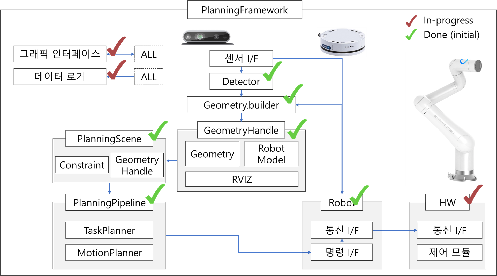

Instruction for RNB-Planning Framework {#mainpage}
============

RNB-Planning Framework is an integrated framework for combined planning of task and motion.  




# 1 Environment Setup  

## 1.1 Tensorflow base environment  
* Follow instruction in [docs/ENVIRONMENT.md](docs/ENVIRONMENT.md)  
   
## 1.2 ROS Setup  
* The planning framework is based on ROS  
* Follow instruction in [docs/ROS_SETUP.md](docs/ROS_SETUP.md)  
 
## 1.3 other dependencies  
* Python Package Dependencies  
```bash
pip install colorama==0.3.9 llvmlite==0.31.0 numba==0.47.0
pip install autograd && pip install --user pymanopt==0.2.4
pip install dash==1.17.0 visdcc dash_split_pane
pip install matplotlib trimesh pathlib protobuf grpcio numpy-stl sklearn filterpy paramiko SharedArray  
pip3 install dill matplotlib sklearn opencv-python SharedArray  
pip install requests beautifulsoup4
```
  
* Install OMPL (takes >30min)
  * Download ompl install bash file [third-party/ompl/install-ompl-ubuntu.sh](third-party/ompl/install-ompl-ubuntu.sh)
  * From the downloaded directory,  
```bash
chmod +x ./install-ompl-ubuntu.sh
./install-ompl-ubuntu.sh --python
```
  
## 1.4 hardware setup
* Setup camera and robot driver/sdk following instructions in [docs/HARDWARE_SETUP.md](docs/HARDWARE_SETUP.md) 
  
# 2 Setup project  
## 2.1 Get project setup path  
* Download and add path to ~/.bashrc  
```bash
mkdir ~/Projects && cd ~/Projects \
&& git clone https://github.com/rnb-disinfection/rnb-planning.git \
&& export RNB_PLANNING_DIR=$HOME/Projects/rnb-planning/ \
&& echo 'export RNB_PLANNING_DIR=$HOME/Projects/rnb-planning/' >> ~/.bashrc
```
  
## 2.2 Build subprojects
* Build moveit-python interpreter, copy it and clean Release folder  
```bash
sudo apt-get remove ros-melodic-ompl \
&& cd "$RNB_PLANNING_DIR"lib/moveit_interface_py \
&& chmod +x ./build.sh \
&& ./build.sh \
&& export LD_LIBRARY_PATH=$LD_LIBRARY_PATH:/usr/local/lib \
&& echo 'export LD_LIBRARY_PATH=$LD_LIBRARY_PATH:/usr/local/lib' >> ~/.bashrc
```

* build openGJK
```bash
cd "$RNB_PLANNING_DIR"lib/openGJK/lib \
&& cmake -DCMAKE_BUILD_TYPE=Release \
&& make
```

* build latticizer
```bash
cd "$RNB_PLANNING_DIR"lib/latticizer \
&& cmake -DCMAKE_BUILD_TYPE=Release \
&& make
```
  
* build custom workspace  
```bash
cd "$RNB_PLANNING_DIR"ws_ros && rm -rf build devel && catkin_make -DCMAKE_BUILD_TYPE=Release  
source "$RNB_PLANNING_DIR"ws_ros/devel/setup.bash
echo 'source "$RNB_PLANNING_DIR"ws_ros/devel/setup.bash' >> ~/.bashrc
```

## 2.3 (Optional) Install PDDLStream
* To use PDDLStream task-motion planning, follow instruction in [docs/PDDLStream.md](docs/PDDLStream.md)

## 2.4 Recommended Tools and Options
* Follow instruction in [docs/SUPPLEMENT_README.md](docs/SUPPLEMENT_README.md)
* To use eTaSL planner and **online planning**, follow instruction in **eTaSL** in [docs/SUPPLEMENT_README.md](docs/SUPPLEMENT_README.md)

## 2.4 fix default grub setting (disable linux kernel update)  
* check list of kernel 
```bash
awk -F\' '/menuentry / {print $2}' /boot/grub/grub.cfg 
```
* Edit /etc/default/grub contents as following
```
GRUB_DEFAULT=0  ## Change this if the real time kernel is not loaded. remember the location of the kernel on the grub menu when you boot the computer, and change accordingly, ex) "1>2"
GRUB_TIMEOUT_STYLE=menu  
GRUB_TIMEOUT=5  
```
* sudo update-grub  
* disable kernel update  
  * sudo apt-mark hold linux-image-generic linux-headers-generic  

# 3 How to

* For further instruction on how to use & develop, read [docs/HOW_TO.md](docs/HOW_TO.md)


# 4 Check shell environemnt settings
* ~/.bashrc should contain following lines.  
   ```  bash
   # export PATH=$PATH:~/.local/bin  

   # CUDA
   export PATH=$PATH:/usr/local/cuda-11.0/bin
   export CUDADIR=/usr/local/cuda-11.0
   if [ -z $LD_LIBRARY_PATH ]; then
   export LD_LIBRARY_PATH=/usr/local/cuda-11.0/lib64
   else
   export LD_LIBRARY_PATH=$LD_LIBRARY_PATH:/usr/local/cuda-11.0/lib64
   fi

   # ROS
   alias eb='nano ~/.bashrc'
   alias sb='source ~/.bashrc'
   alias gs='git status'
   alias gp='git pull'
   alias cw='cd ~/catkin_ws'
   alias cs='cd ~/catkin_ws/src'
   alias cm='cd ~/catkin_ws && catkin_make'
   source /opt/ros/melodic/setup.bash
   source ~/catkin_ws/devel/setup.bash
   export ROS_MASTER_URI=http://localhost:11311
   export ROS_HOSTNAME=localhost

   # RNB-PLANNING
   export RNB_PLANNING_DIR=$HOME/Projects/rnb-planning/

   # custom-ompl
   export LD_LIBRARY_PATH=$LD_LIBRARY_PATH:/usr/local/lib

   # custom-workspace
   source "$RNB_PLANNING_DIR"ws_ros/devel/setup.bash

   # JetBrains  
   export PATH=$PATH:$HOME/pycharm-2020.2/bin  
   export PATH=$PATH:$HOME/clion-2020.2/bin  
   ```
